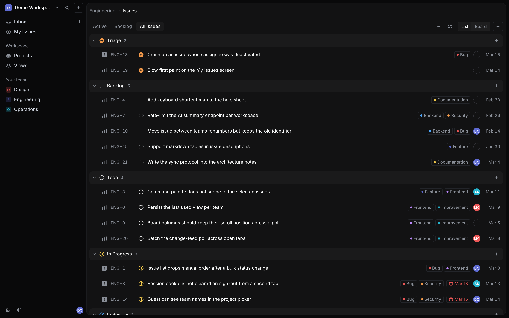
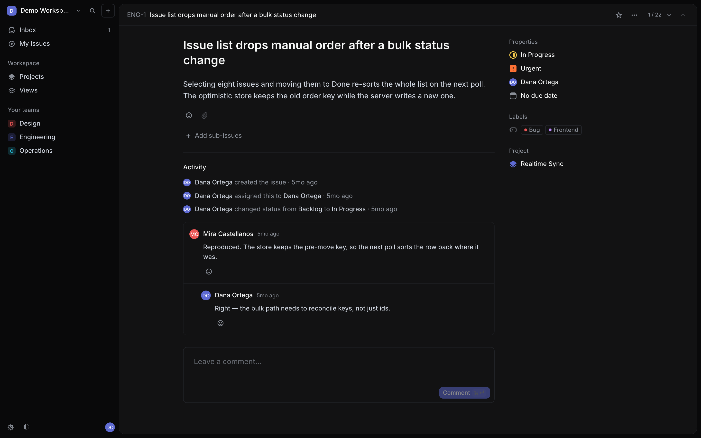
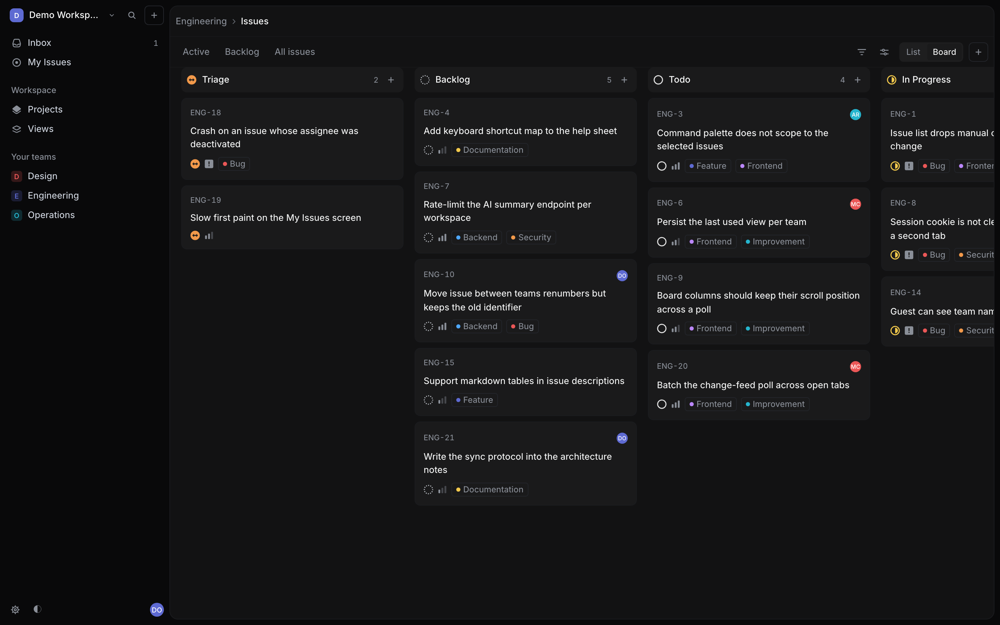
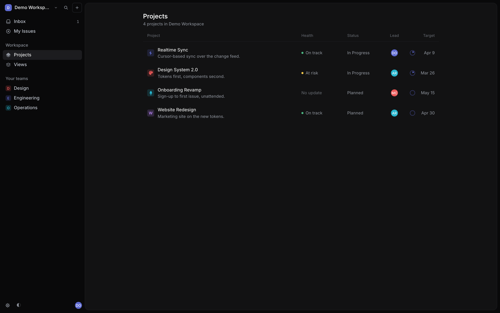
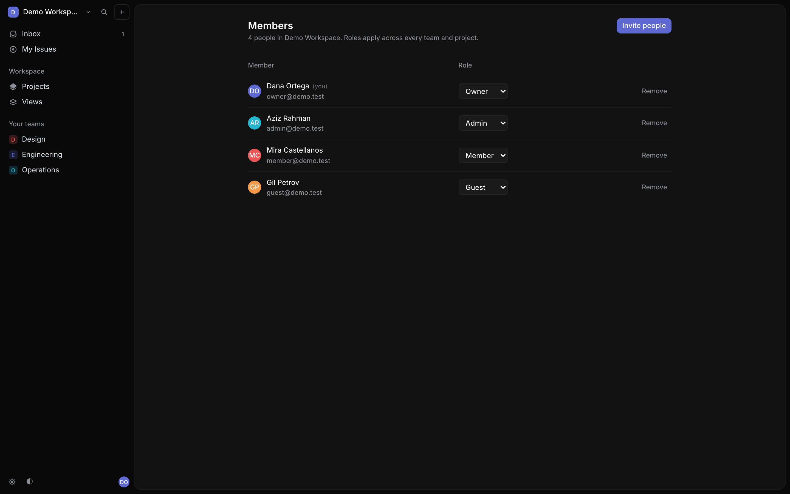
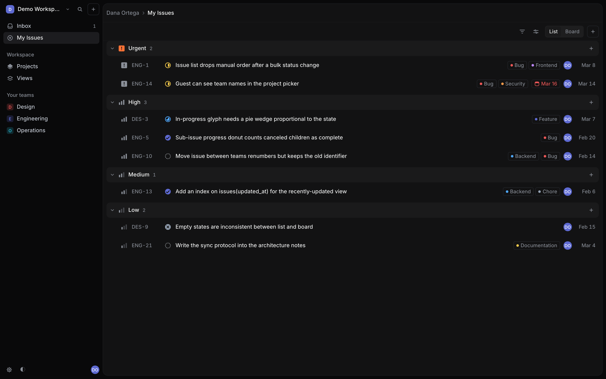
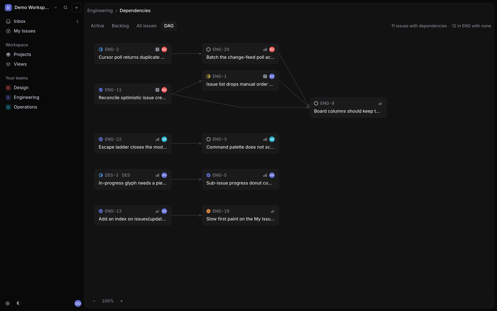

# Linear

> **the issue tracker, rebuilt from measurements**

A rebuild of [Linear](https://linear.app) — issues, projects and teams, with
real multi-user membership. Four people at four permission levels, a keyboard
model, and a workspace that boots with one command and no database to install.

| Issue list | Issue detail | Board |
|---|---|---|
|  |  |  |

| Projects | Members | Marketing | DAG |
|---|---|---|---|
|  |  |  |  |

Next.js 16 · PostgreSQL everywhere (WASM locally, Neon deployed) ·
**1,559 unit tests** · 23 e2e tests · built from six parallel research lanes,
then seven parallel build slices — plus one feature Linear does not have: a
**DAG** tab per team, drawing the blocking relations nobody can currently see
more than one hop of.

```bash
pnpm install && pnpm run dev     # http://localhost:3000 — no database to set up
```

Sign in as `owner@demo.test` / `demo1234`. Also `admin@`, `member@`, `guest@` —
each sees a different application, which is the point.

---

## What it does

**Issues** carry the identifier (`ENG-123`), a markdown description, workflow
state, priority, assignee, labels, estimate, due date, sub-issues, relations,
project, subscribers, comments and an activity feed. **Views** are list or
board, grouped by status / assignee / priority / project / label, filtered and
manually ordered. **Projects** have a lead, members, milestones, status, health
and updates. **Teams** own their workflow states, labels and membership.

**Permissions are the part that had to be real.** Workspace roles
(owner / admin / member / guest) and team roles compose with project
membership; a guest sees only what they were added to, and a private team is
invisible even to a full workspace member. `/settings/members` refuses a member
outright rather than rendering a read-only version of itself.

**One thing Linear does not have.** Every team has a **DAG** tab: its blocking
relations drawn as a directed graph, blockers on the left pointing at what they
block. Linear stores `blocks` / `blocked_by` but only ever shows one hop, on the
issue you happen to be reading — so a four-issue chain is invisible unless you
already know to walk it, and a dependency *cycle* is invisible from everywhere.
The graph follows a chain across team boundaries, stops dead at a team you
cannot see, and draws a loop in red with the issues named. Cards are real links.
Layout is a pure function on the server (Sugiyama: cycle-break, layer, reduce
crossings, place, route), so nothing reflows after hydration. See D27.

**Cut deliberately:** cycles, initiatives, SLAs, customer requests,
integrations, insights, documents, offline sync. The brief allowed dropping the
less-used features to get the central ones exactly right.

**The one thing that cannot be replicated** is Linear's native agents. Instead
there is a provider-agnostic connector port with Anthropic and OpenAI adapters
— and a disabled adapter, so an unconfigured clone renders an explanation
rather than an error.

---

## How it was built

### Six research lanes, in parallel

9,095 lines in `research/`, gathered before a line of application code:
visual design, product features, data model, interaction, open-source
architecture, and stack. Four findings changed the build:

**The public colour values are the wrong ones.** Almost every Linear hex in
circulation — `#08090a`, `#1c1c1f`, `#f7f8f8` — belongs to linear.app, not to
the product. The application is `#09090a` chrome around a `#121213` content
pane with `#1a1a1b` on hover. The lane pixel-sampled the running app and
corroborated it against Linear's own splash CSS.

**The status glyph is a progress indicator with exact geometry.** Two
concentric circles; the wedge is `stroke-dasharray "A 2A"` with
`A = 2π × 1.94 = 12.189379495928398` — radius **1.94, not 2**, a 3% shortfall
that stops the wedge closing into a seamless disc at 100%. Backlog's dashed
ring is exactly 12 dashes. All three checked against Linear's shipped
attributes.

**`completedAt` is cleared, not sticky.** Linear stamps it on entering a
completed state and *clears it* when the issue leaves. Deriving it from the
activity log — "the timestamp of the last transition into a completed state" —
looks equivalent and silently corrupts every rollup.

**Server Actions dispatch sequentially, one at a time per client.** Five bulk
edits would serialise five round trips in an app whose reputation is that it
responds instantly. Mutations go to Route Handlers.

### Then seven build slices, in parallel

Data layer · auth and authorization · design system · app shell and list/board ·
issue detail · projects/teams/members · marketing, palette and search. Each
owned a disjoint set of files and verified itself.

Two slices reported the same class of problem from opposite directions, and the
disagreements were the most useful output of the whole exercise — see
`DECISIONS.md` D16–D21.

---

## Decisions worth knowing

The full log is [`DECISIONS.md`](DECISIONS.md); the specification is
[`SPEC.md`](SPEC.md). The five that shaped everything else:

**One database dialect, two engines** (D1). PGlite — Postgres compiled to WASM
— runs locally and in tests; Neon runs deployed. The alternative, SQLite
locally, means writing every statement twice *and* accepting that the two
engines disagree quietly: SQLite's default collation is byte-wise and
Postgres's is not, which is precisely what manual ordering depends on.

**Order keys are strings, not floats** (D4, D5). Linear uses a float
`sortOrder`; a double exhausts precision after ~50 inserts into the same gap
and the list silently stops holding its order. A fractional-index string grows
a character instead. Written by hand first — it failed 8 of its own 25 tests on
the magnitude boundaries — then delegated to the reference implementation, with
a wrapper that rejects the swapped-neighbour case the library silently accepts.

**`collate "C"`, declared explicitly** (D3). Postgres' default ICU collation
folds case, so `Zz` — the key for "drag to top" — sorts *last*. **PGlite's
default collation is already byte-wise, so this bug cannot reproduce locally.**
It is the one place the "PGlite matches production" claim is not
self-evidently true, so the schema says so out loud.

**Authorization is one table the compiler proves exhaustive** (D9). `can(actor,
action, resource)` over a `Record<Action, Record<RoleKey, Cell>>` applied with
`satisfies` — a missing row, a missing cell or a typo'd key is a compile error.
The 416-case matrix test is hand-transcribed from the research and never
derived from the policy, because a derived expectation passes against any
table, including an all-deny one. A grep test fails the build on a role
comparison written anywhere else.

**Project membership grants edit rights** (D8). The brief's requirement, and a
deliberate divergence: in Linear, project membership carries no permissions at
all. Purely additive — it never removes access Linear would give.

---

## What is verified, and what is not

Claims here are separated by how they were checked.

**Verified against the running application**, by driving the HTTP API directly:

| | |
|---|---|
| guest opens a project behind a private team | `404` |
| owner `POST`s them into the project | `201` |
| guest opens it, then `PATCH`es its name | `200`, `200` |
| owner `DELETE`s the membership; guest retries | `404`, `404` |
| admin promotes a member to admin | `200` |
| that admin then removes their new peer | `403 RANK_NOT_ABOVE_TARGET` |

That is the brief's headline requirement and the one-way-door rule (D19),
working end to end.

**Verified by the suites:** 1,559 unit tests, `tsc --noEmit` clean, `eslint`
clean, `next build` succeeding, and **23 e2e tests, none skipped** — 14
permission tests covering invitation, the one-way admin promotion, last-owner
protection, guest team scoping, private-team invisibility and the whole
add-to-project → edit → add-an-issue → remove cycle through the UI, plus 9 for
the DAG, including the one that matters: the same URL rendering two different
graphs for two different people.

**Proved by mutation, not just by passing:** five assertions were confirmed to
fail when the code they cover is reverted — the rate limiter's eviction policy,
the `issue.reorder` gate, and three in the graph layout (keeping the best
ordering, translating the canvas to its origin, and measuring edge bends in the
bounds). A test that has never been seen to fail is a test that has not been
seen.

The last of those was skipped until recently (D22): `POST /api/issues`
pre-gated on `canViewTeam` before consulting `issue.create`, so the gate was
broader than the policy row it guarded and a project member could not file into
their own project. It now authorizes `issue.create` against the whole resource
— team *and* project — and answers `404` rather than `403` when the caller may
not know the team exists.

**An independent review found eighteen more.** Running `codex` over the
finished code turned up defects the suites could not: an idempotent-create
replay that returned *any* issue whose id you supplied, including ones you
could not see; `updateState` accepting a workflow state belonging to another
team; project creation using `teams.some(...)` where it needed `every(...)`, so
one permitted team smuggled a private one in beside it; and several 403-vs-404
pairs that together formed an existence oracle. All eighteen are fixed, each
with a regression test that was verified to fail against the code before it.

**A second, wider review found twenty more.** The first pass was aimed at four
areas; this one was pointed at everything. The ones worth naming:

- **Colours were a script-adjacent surface** (D23). Every colour field was
  `z.string().max(40)` and every colour ends up assigned to a CSS property, so
  an authorised member could name a label `url(//attacker.example/pixel)` and
  every *other* member's browser would fetch it whenever the label rendered.
  React escapes text; it does not escape the value of a style property. Now a
  whitelist — six hex digits — enforced in `src/domain/color.ts` *and* as a
  `check` constraint on all six columns, so a future call site that forgets the
  module cannot reopen it.
- **The invite preview disclosed somebody else's email address.** It returned
  `invites.email` to pre-fill the sign-up form, from an endpoint that asks for
  no credential at all. The link is a bearer token, so its holder is not
  necessarily the person it was meant for — a forwarded invite handed over the
  address of whoever the admin actually meant to invite. The convenience it
  bought was two seconds of typing for someone who knows their own address.
- **The two endpoints that run scrypt for a stranger were unthrottled.** Both
  spend 128 MB and ~200 ms before anything about the caller is established,
  which is resource exhaustion and an online-guessing oracle wearing one
  costume. Now a token bucket on *both* the IP and the email — either alone is
  trivially walked past — spent before the derivation and refunded on a correct
  password, so an honest user never meets it.

**A third review, of the fixes themselves.** The second round's repairs had not
been reviewed, and reviewing them found seven more — including one where a
concurrent agent had silently reverted a fix I had already made and verified:
the project PATCH schema was back to `z.string().max(40)`, and only the database
constraint was still stopping the payload. Of the rest:

- **A bounded limiter is a limit reset** (D24). The token-bucket map had no
  ceiling, so a burst of distinct keys grew it without bound and made every
  insert scan it. Adding a ceiling then created the subtler bug: eviction hands
  a key a fresh budget, so dropping the *oldest* lets a throttled attacker
  flood their own entry out and start again. Victims are chosen fullest-first.
- **A bucket keyed on a header the caller sends is not a bucket** (D25).
  `x-forwarded-for` is now believed only where something is known to overwrite
  it.
- **An invite outlived its inviter's authority** (D26). Deactivation does not
  delete a role row, so a fired administrator's pending invitations kept
  working.
- **`issue.reorder` could be bypassed by bundling.** The route asked for it only
  when `sortOrder` arrived alone, and authorization is OR — so
  `{title, sortOrder}` was authorised by the author's `update_own` and moved the
  issue in everyone's list.
- **Sign-up's throttle was charged before its cheapest rejection**, so five
  invite-less requests naming a victim's address locked that address out of its
  own invitation.

**Five bugs the running app found that no unit test could:**

- Tailwind v4's content detection scanned `research/screenshots/*.png` and
  generated class names from the compressed bytes, emitting invalid CSS that
  failed to parse — every route returned 500. The error names a token that
  appears nowhere in the source.
- My base stylesheet was **unlayered**, and unlayered CSS beats layered CSS, so
  `button, input, textarea { font: inherit }` silently defeated every
  typography utility on a form element. The issue title — a `<textarea>` —
  rendered at 13px/450 instead of 24px/590.
- `isTeamView` was imported by a server component from a `"use client"` module,
  which yields a client *reference* rather than a function. It typechecks,
  lints, and throws at request time.
- Optimistic writes were being **cancelled by page teardown** (D21). `callApi`
  used an ordinary page-bound `fetch` and the panels committed the optimistic
  state the moment it was *issued*, so a navigation in the same tick killed the
  request before the server read it — the member appeared on screen and no
  `POST` line appeared in the log. Worse, with nothing distinguishing *sent*
  from *saved*, a dependent mutation could overtake the one it depended on: a
  promote and a remove raced, the remove was answered first, and it deleted a
  still-`member` account.
- The **e2e suite blamed the application for the harness**. It ran against
  `next dev`, which compiles a route the first time something asks for it —
  and that cost lands inside whichever assertion is first through a given page.
  The symptom was `getByTestId('sidebar')` not found, with a sign-in button
  frozen at "Signing in…", which reads exactly like a hung request. It moved
  between runs: test 6 on one cold start, test 11 on the next, 14/14 against a
  server that happened to be warm. Chasing it through the rate limiter and the
  transaction queue found nothing, because nothing was wrong. The suite now
  runs `next build && next start`, which pays the compile once, up front — and
  as a side effect the assertions now describe the artifact that actually
  deploys rather than a development bundle.

---

## Code index

```
SPEC.md                 the contract every slice built against
DECISIONS.md            27 numbered decisions, with the rejected alternative
research/               9,095 lines from six parallel lanes
  01-visual-design.md     measured tokens, glyph geometry, layout
  02-features.md          product behaviour, 67 features ranked MUST/SHOULD/COULD
  03-data-model.md        entities from Linear's own SDL, proposed schema
  04-interaction.md       shortcut map with confidence tags, optimistic updates
  05-oss-architecture.md  48×8 permission matrix, ordering, anti-patterns
  06-stack-deployment.md  every stack decision with a bolded verdict
```

| Path | What lives there |
|---|---|
| `src/domain/` | `entities.ts` (the vocabulary), `policy.ts` (authorization), `ordering.ts` (fractional index), `color.ts` (the one definition of a colour), `filters.ts`, `sorting.ts`, `services/membership.ts`, `services/graph-layout.ts` (Sugiyama, pure), `services/dependency-graph.ts` (relations → blocking edges, cycles) |
| `src/ports/` | `repositories.ts`, `ai.ts` — interfaces in domain terms, no SQL |
| `src/config/` | `env.ts` (validated environment), `dependency-graph.ts` (every DAG tunable, in one place) |
| `src/adapters/db/` | `driver.ts` (the seam), `pglite.ts`, `neon.ts`, `schema.sql` (25 tables), `schema.ts` (generated, drift-guarded) |
| `src/adapters/repositories/` | one module per aggregate |
| `src/adapters/ai/` | `anthropic.ts`, `openai.ts`, `shared.ts` — raw HTTP, symmetric on purpose |
| `src/lib/` | `auth/` (scrypt, sessions, invites, `rate-limit.ts`), `boot.ts`, `seed.ts`, `keyboard/`, `store/`, `ids.ts`, `markdown.ts` |
| `src/components/ui/` | 16 primitives — combobox, popover, status/priority glyphs, avatar, toast |
| `src/components/` | `app-shell` 11 · `issue-detail` 17 · `issues` 13 · `projects` 12 · `members` 8 · `marketing` 6 · `auth` 6 · `command-palette` 5 · `teams` 4 · `inbox` 4 · `search` 3 |
| `src/app/` | 15 routes + 27 API handlers |
| `e2e/` | `permissions.spec.ts` — the multi-user journey; `dependency-graph.spec.ts` — the DAG, including the same URL showing two people two graphs; `README.md` — the test-id contract |

### Commands

```bash
pnpm run dev            # PGlite, seeded on first boot
pnpm run verify         # typecheck + lint + 1,559 unit tests
pnpm run test:e2e       # Playwright, against a production build
pnpm run build:schema   # regenerate schema.ts from schema.sql
pnpm run db:push        # apply the schema (Vercel build command)
```

### Deploying

Set `DATABASE_URL` to a Neon connection string and `AUTH_SECRET` to
`openssl rand -base64 32`. Everything else has a working default; the app
refuses to boot in production on PGlite rather than serving traffic from a
filesystem the platform discards. Migrations run from the build command,
because a serverless function that migrates on first request migrates once per
cold start.

`ANTHROPIC_API_KEY` or `OPENAI_API_KEY` enable the AI connectors. Neither is
required — without them the panel explains what to set.
