# Replicates

Exploring Agentic Software Development through building established software products from scratch in just a few prompts.

Each folder is a self-contained project with its own README, spec, decision log
and research notes.

---

## [Risk](Risk) — RISK: Global Domination, with the dice in the action log

> **the engine never rolls a die**

A rebuild of [RISK: Global Domination](https://www.smgstudio.com/risk), SMG Studio's
digital RISK: solo against five bot tiers, hot-seat for up to six on one device, and
casual online games behind a four-letter lobby code. Sixteen boards, eleven modifiers
(Fog of War, Capitals, Blizzards, Portals, Percentage Domination, Balanced Blitz
dice, …), forty-two preset chat lines and no free text anywhere.

| Deploying troops | The Blitz view | Choose a map |
|---|---|---|
|  |  |  |

**The engine contains no randomness at all.** `apply(state, map, action)` is pure, and
every random outcome — the opening deal, each card drawn, each battle's exact losses —
is data inside the action that caused it. The action log is the game: replaying it must
reproduce the authority's hash at every row, which is the first end-to-end test, and it
is why online play needs no trust in the client. A layering test reads `src/engine`
off disk and fails the build on `Math.random`, a clock, or a React import.

**Balanced Blitz is reproduced to fifteen decimal places from SMG's own published
examples**, four-stage reshape and all: thirty attackers against a capital held by
fifteen, losing exactly twelve, is `0.0100282888709122` under Balanced Blitz against
`0.02221280017072782` under True Random, and forty-nine is the fewest attackers for an
80% Blitz against fifty. The bots use the odds table of the dice mode in play, because
a bot given the wrong table misjudges its own attack by up to fourteen points.

**Online play is one Postgres table and a polling loop, sized to the free tier.** No
WebSockets, no realtime vendor: an append-only action log behind route handlers,
clients polling at 2 s on their turn and 4 s off it, bot turns and timeouts run lazily
inside whichever poll arrives next, and a `204` with no body when nothing changed.
Twenty players online an hour a day fits with a third to spare; around the clock does
not, and the spec says so.

**No legitimate RISK geometry exists, so the boards are public domain or generated.**
Three come from a public-domain fan project's territory paths; nine regional boards are
dissolved out of Natural Earth data by a committed pipeline that derives adjacency from
shared borders; a seeded Voronoi generator makes the rest. The classic 42-territory
graph was verified against nine independent sources, seven of which agree exactly.

Next.js 16 · a pure engine with an enforced layering rule · exact O(A·D) battle odds ·
**1,882 unit and property tests** · 10 e2e tests across desktop and mobile Chrome · 16
boards · PostgreSQL only for online play (WASM locally, Neon deployed). Built from eight
parallel research lanes, then seven parallel build slices, then four review rounds (one
codex, three Claude — codex ran out of credits after round one) that returned seventy
findings, every one fixed.

**Live: [risk-david.vercel.app](https://risk-david.vercel.app)** ·
**[Read the README →](Risk/README.md)** ·
[Spec](Risk/SPEC.md) · [Decisions](Risk/DECISIONS.md) · [Research](Risk/research)

---

## [Island Empire](island-empire) — the Slay-like, on a square grid

> **every tile pays one gold a day; every knight eats it**

A rebuild of [Island Empire](https://play.google.com/store/apps/details?id=com.hbrz.wodan),
HBRZ-Developer's mobile territory game descended from Slay and Antiyoy. A
twelve-level campaign with the original's tutorials, random maps against the
AI, hot-seat for eight, weekly challenges and a map editor whose maps are
shareable by link.

| Overworld | A level | Map editor |
|---|---|---|
|  |  |  |

The developer publishes no rulebook, so **every rule was read off the game's
screenshots and walkthrough videos** — and they contradicted every text source.
Reviews and the Slay genealogy say hex; the frames show a **square grid with
4-neighbour adjacency**, shield badges that never sit on a diagonal, and walls
that protect only their own tile while a city protects the four around it.
Knight level 1 costs `10` and eats `2` a day, level 2 costs `20` and eats `5`,
a farm costs `12` and pays `5`: all from unit cards. The numbers no card ever
showed are extrapolations and are labelled as such.

The engine is a pure function — `apply(state, action)` — with a test that fails
the build on any import of React, the DOM or `Math.random`; the AI, the map
generator and undo (a replay of the turn from a snapshot) live inside it. Every
sprite is drawn from code onto a 32-pixel canvas; nothing in the folder is an
asset.

Next.js 16 · canvas renderer with code-drawn pixel art · **434 unit and property
tests** · 25 e2e across desktop and mobile Chrome · Postgres only for sharing
custom maps (WASM locally, Neon deployed). Built from six parallel research
lanes, then five parallel build slices, then eight rounds of codex review
(41 findings fixed or reconciled; a ninth round was blocked by Codex credits).

**[Read the README →](island-empire/README.md)** ·
[Spec](island-empire/SPEC.md) · [Decisions](island-empire/DECISIONS.md) · [Research](island-empire/research)

---

## [FL Studio](fl-studio) — the beat, not the DAW

> **program it, arrange it, hear it, save it**

A browser rebuild of [FL Studio](https://www.image-line.com/fl-studio/)'s core
sequencing loop — Channel Rack, Piano Roll, Playlist, a minimal Mixer and the
transport that drives all four. Not DAW parity: the one workflow that made FL
what it is, built properly.

| Channel Rack | Piano Roll | Playlist |
|---|---|---|
| 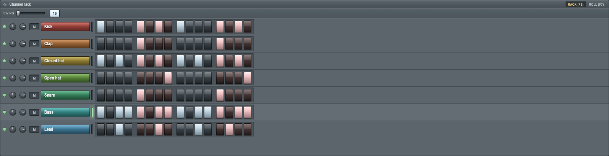 | 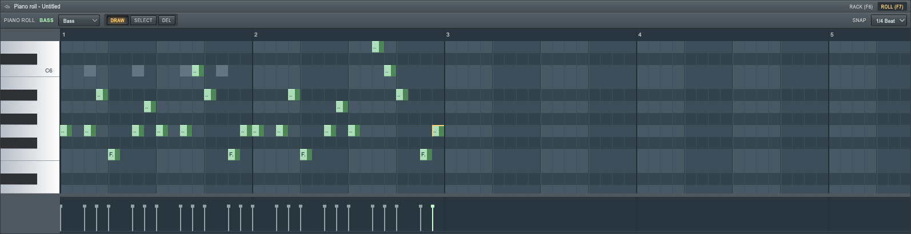 | 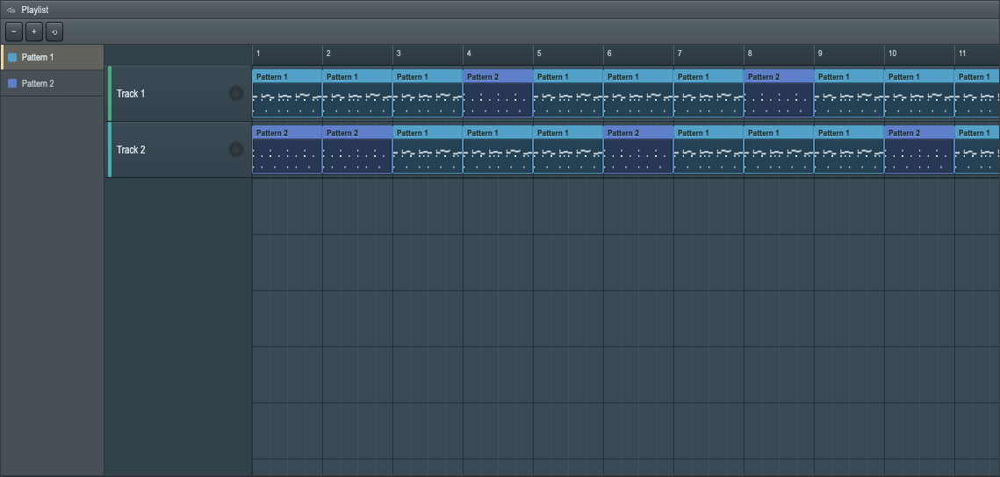 |

The bet is one sentence: **the step grid and the piano roll edit the same
list.** FL has no separate `Step` entity and neither does this — a rack step is
a note of zero length at a quantized tick, so opening the piano roll on a drum
channel shows the steps you clicked, as notes, because they always were. Store a
step *index* instead and you have a second coordinate system in the project by
the end of the first day. **Every sound is synthesized from oscillators, noise
and filters at runtime** — not one sample ships, which started as a licensing
decision after research found that even "royalty-free" 909 cymbals may still
carry Roland's copyright. The look is measured rather than approximated: pixel
run-length scans of Image-Line's own manual captures gave the 24px step pitch,
the cool/warm four-step hue alternation and the piano roll's three gridline
weights, and the roll itself is one canvas painted by a pure function.

Next.js · Tone.js as the clock with hand-built native voices · 1,256 unit tests ·
15 Playwright e2e. Built from seven parallel research lanes, then seven parallel
build slices, then twenty rounds of codex review run to a clean pass.

**[Read the README →](fl-studio/README.md)** ·
[Spec](fl-studio/SPEC.md) · [Decisions](fl-studio/design-decisions.md) · [Research](fl-studio/research)

---

## [Linear](Linear) — the issue tracker, rebuilt from measurements

> **four people, four permission levels, one keyboard**

A rebuild of [Linear](https://linear.app) — issues, projects and teams, with
membership that is actually enforced. A guest sees a different application to
an admin, a private team is invisible even to a full workspace member, and
adding someone to a project grants them edit rights on it.

| Issue list | Issue detail | Board |
|---|---|---|
| 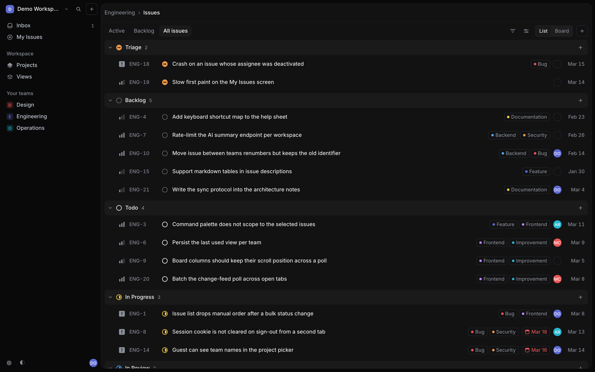 | 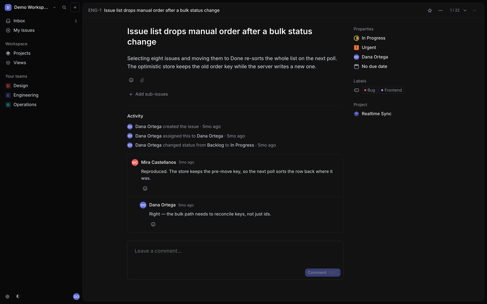 | 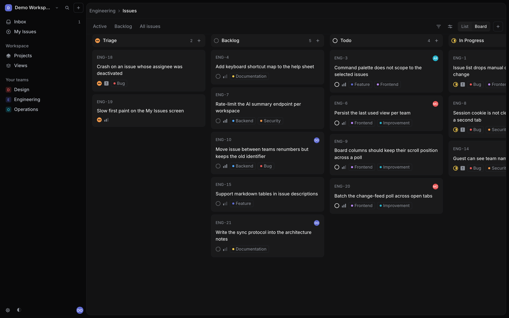 |

The colours are **measured from the running product, not the marketing site** —
almost every Linear hex in circulation belongs to linear.app rather than the
app. The status glyph's progress wedge uses radius 1.94, not 2, a 3% shortfall
that stops it closing into a seamless disc. Manual ordering is a
fractional-index string rather than Linear's float, which exhausts double
precision after about fifty drags into the same gap and then silently stops
holding its order.

`pnpm install && pnpm run dev` and it runs — Postgres compiled to WebAssembly, so
there is no database to install, and the same SQL runs on Neon when deployed.

Next.js · 1,314 unit tests · 9 e2e permission tests · a 48×8 authorization
matrix the compiler proves exhaustive. Built from six parallel research lanes,
then seven parallel build slices.

**[Read the README →](Linear/README.md)** ·
[Spec](Linear/SPEC.md) · [Decisions](Linear/DECISIONS.md) · [Research](Linear/research)

---

## [super-smash](super-smash) — Super Smash Bros. Ultimate, on a laptop keyboard

> **eight fighters, one keyboard, sixty frames a second**

A rebuild of [Super Smash Bros. Ultimate](https://www.smashbros.com)'s versus mode — the
brawl, which is the mode that has carried across every game in the series since 1999 and is
the one nearly everybody actually plays. The knockback equation is Ultimate's, the stage
geometry is Kurogane Hammer's, and the frame data comes out of the game's own decompiled
scripts.

| Character select | The match | Stage select |
|---|---|---|
| 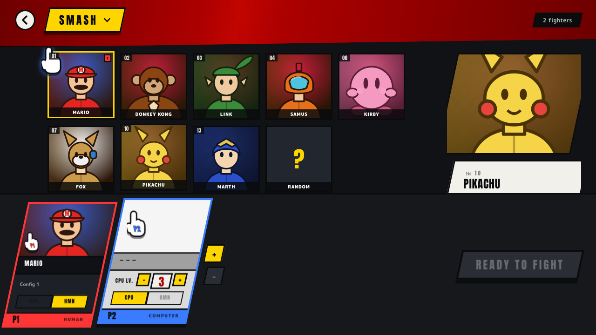 | 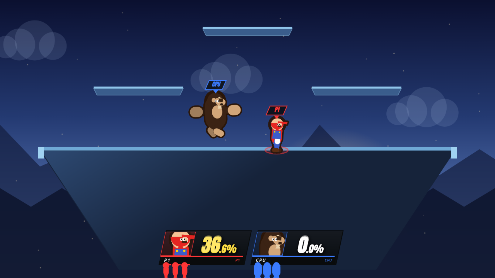 | 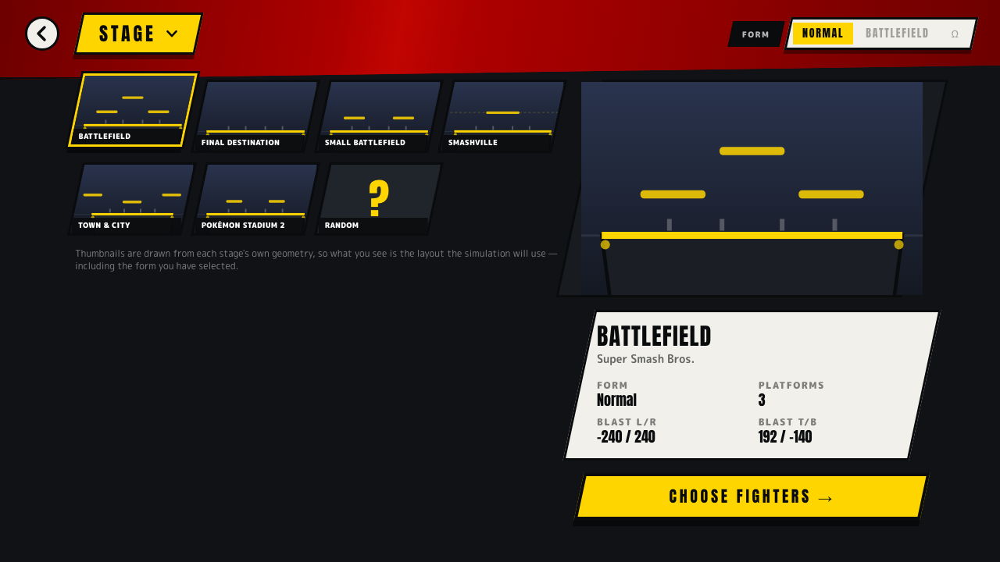 |

Every fighter is **drawn from code** — a bone hierarchy of capsules and circles — because
there is no legitimate way to obtain Nintendo's art, and because every open-source Smash
clone that tried to ship real sprites stalled on making them. Every sound is synthesised
from oscillators. Nothing in the repository is an asset.

It also does one thing the original does not: **rollback netcode**. Ultimate is delay-based.
And the shared-WiFi case needed no code at all — ICE gathers host candidates and prefers the
LAN route on its own, so two laptops in one room get a direct sub-10ms path for free.

Next.js · a pure fixed-point simulation with a test that fails the build on `Math.random` ·
1,285 unit and property tests · 7 e2e · rollback verified against a ground-truth run at six
link conditions. Built from eight parallel research lanes, then six parallel build slices.

**[Read the README →](super-smash/README.md)** ·
[Spec](super-smash/SPEC.md) · [Decisions](super-smash/DECISIONS.md) · [Research](super-smash/research)

---

## [fake-phone](fake-phone) — a staged incoming call, for when you feel unsafe

> **never feel alone**

A personal-safety web app that replicates the iOS and Android phone call screens,
plus a live-stream mode over the real camera. Open it and a call arrives; to
anyone watching, someone knows where you are and is on the way.

| iOS incoming | iOS in-call | Android swipe-to-answer |
|---|---|---|
| 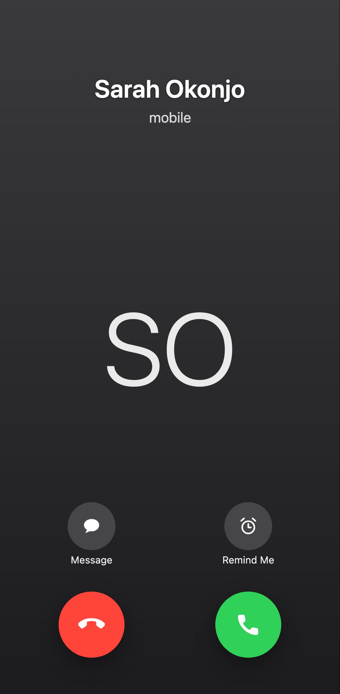 | 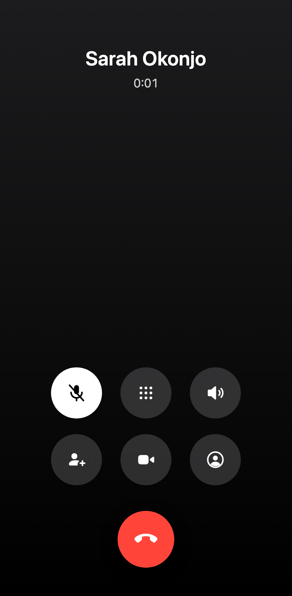 | 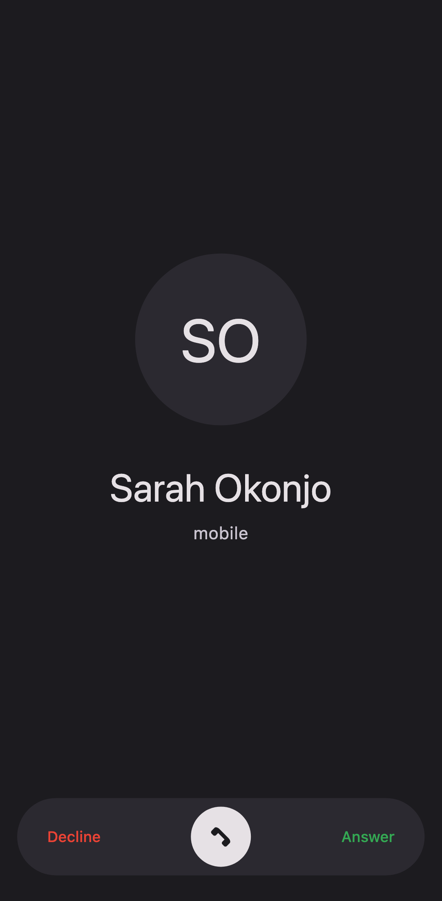 |

| Home / settings | Live-stream mode | Delayed ring |
|---|---|---|
| 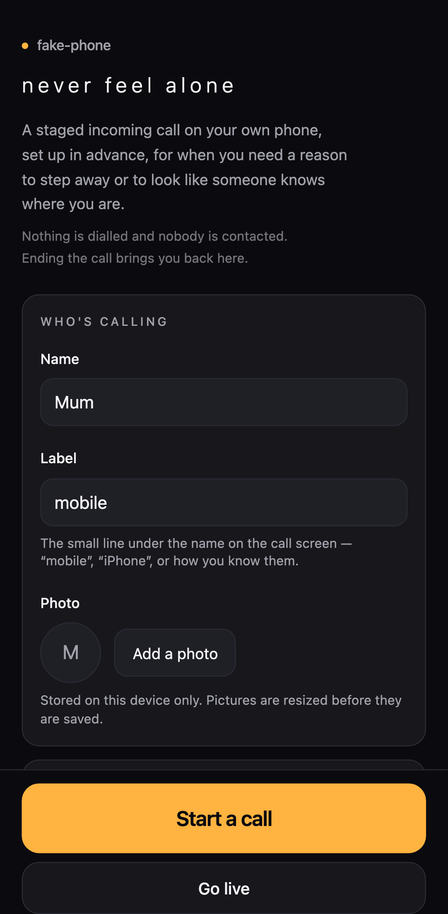 | 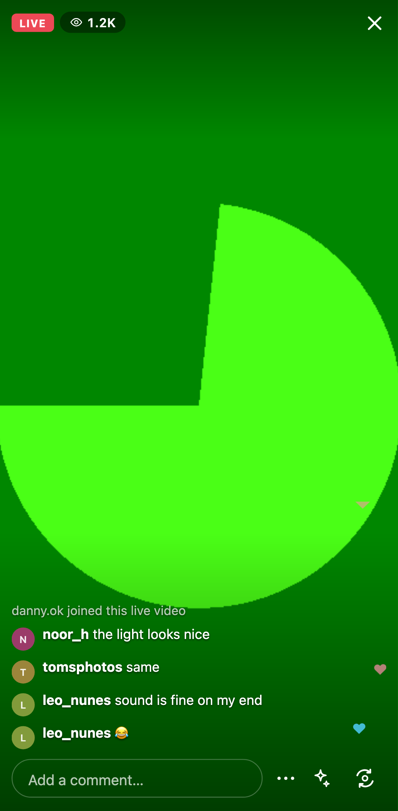 | 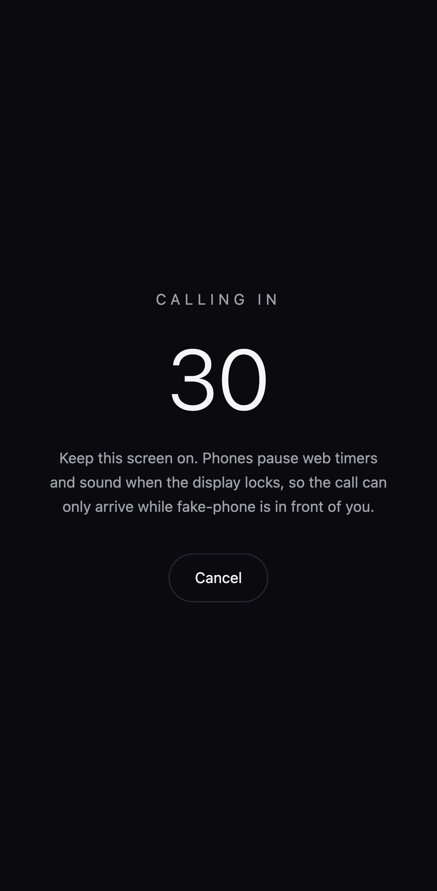 |

Next.js · three voice tiers (silent / scripted / AI-ready) · installable PWA ·
363 unit tests · 89 e2e across mobile Safari, mobile Chrome and desktop.
Built from six parallel research lanes, then six parallel build slices.

**[Read the README →](fake-phone/README.md)** ·
[Spec](fake-phone/SPEC.md) · [Decisions](fake-phone/DECISIONS.md) · [Research](fake-phone/research)

---

## [bet](bet) — a private, friend-first prediction market

Play-money prediction markets for small groups, priced with Hanson's LMSR rather
than an order book, because a central limit order book with six participants is
an empty book.

**[Read the README →](bet/README.md)** ·
[Spec](bet/SPEC.md) · [Decisions](bet/DECISIONS.md) · [Research](bet/research)

---

## [dollar-pixels](dollar-pixels) — the Million Dollar Homepage, at $1 for nine pixels

> **$1 buys nine pixels**

A rebuild of the 2005 page that sold a million pixels at a dollar each. This one
sells them in blocks of nine — a 3 × 3 square for a dollar — on a 400 × 400 block
grid, and adds the thing the original could not: you can buy a page of your own.

| The wall | Selecting blocks | Making a page |
|---|---|---|
| 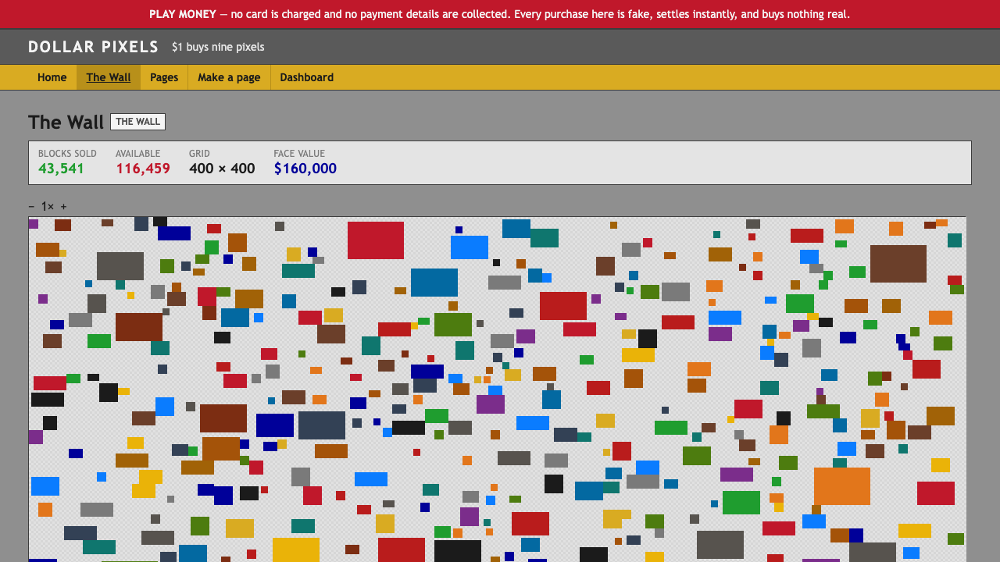 | 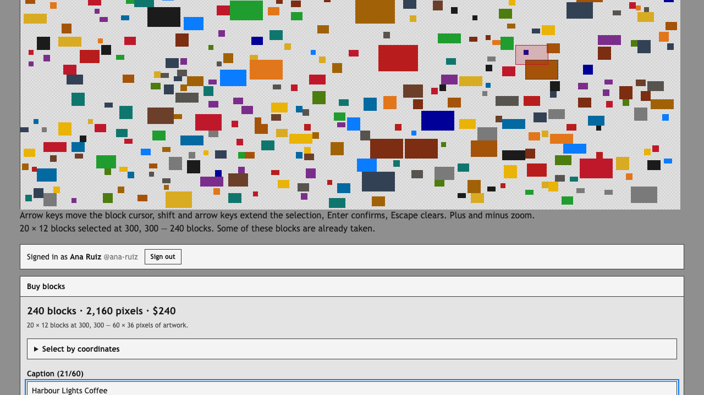 | 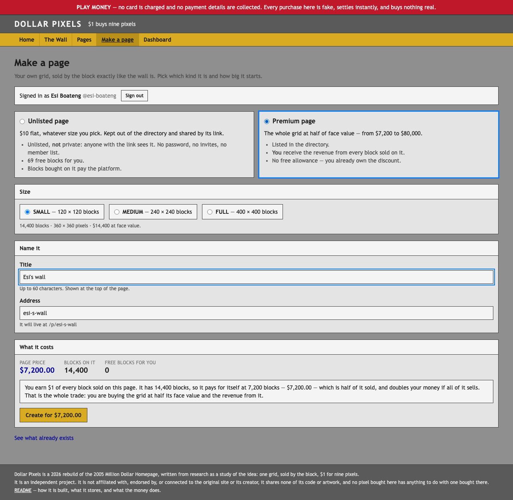 |

The grid is 1200 × 1200 rather than the original's 1000 × 1000 because 1000 is not
divisible by three — a nine-pixel block cannot sit on that canvas without being
split. Blocks carry a caption and artwork but no link, which is the one part of
the original deliberately not rebuilt: a 2017 study found 547 of its links dead,
and the surviving mirror has quietly rewritten 1,164 more to archive snapshots.

Play money by default, with Stripe one environment variable away — both settle
through the same code, so the switch is not a leap of faith. Unlisted pages cost
$10 and come with 69 free blocks; premium pages cost half the grid's face value
and pay their creator for every block anyone buys on them.

Next.js · canvas renderer with O(1) hit-testing · ports for storage and payment ·
414 unit and property tests · 30 e2e across desktop and mobile.
Built from five parallel research lanes, then five parallel build slices.

**[Read the README →](dollar-pixels/README.md)** ·
[Spec](dollar-pixels/SPEC.md) · [Decisions](dollar-pixels/DECISIONS.md) · [Research](dollar-pixels/research)

---

## [youtube](youtube) — the video platform, with the transcoding moved to the uploader

> **the server never opens a codec**

A rebuild of [YouTube](https://www.youtube.com)'s core: upload, an adaptive player,
channels, subscriptions, playlists, threaded comments, search, a recommender, watch
history, Shorts, and Content ID.

| Home | Watch |
|---|---|
| 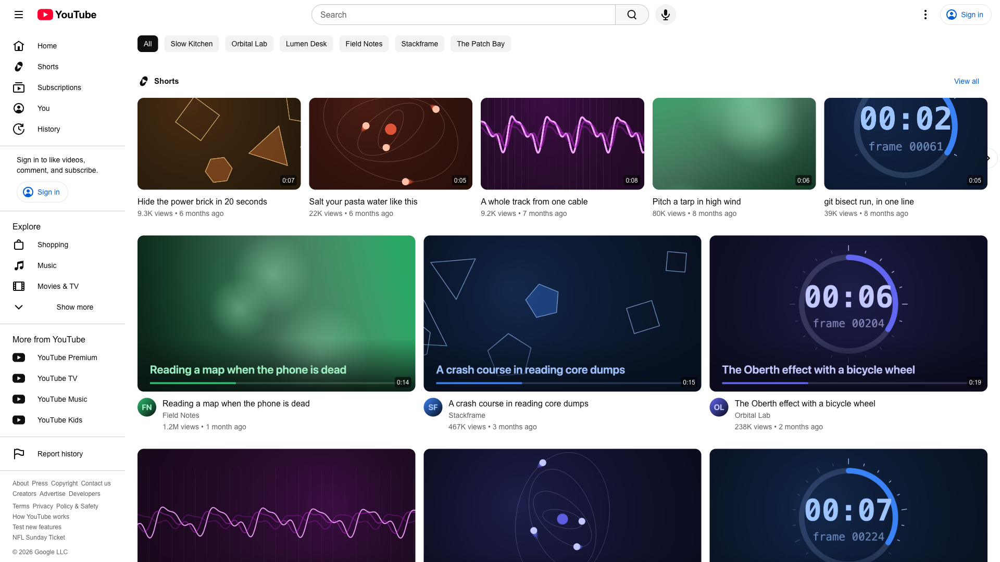 | 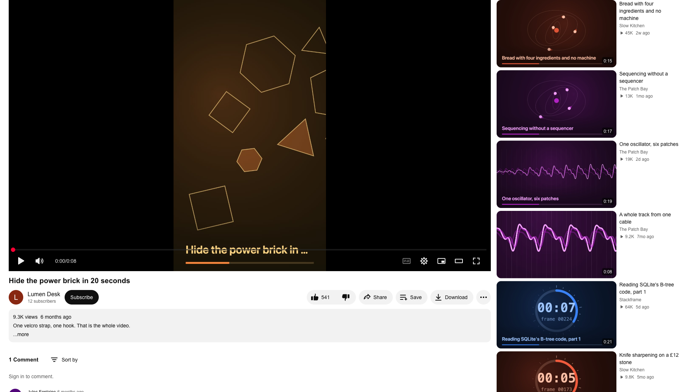 |

The bet is one line long: **the uploader's browser encodes the whole rendition ladder
before anything is sent.** Transcoding scales with uploads rather than with revenue, so
it moves to the one machine already idle and already holding the file — and the expensive
part of the system then does not exist. No queue, no worker pool, no backlog.

Everything between `VideoEncoder`'s output and a playing video is written here: an MP4
demuxer, a hand-written fMP4 muxer, an HLS packager, and an MSE player with its own ABR.
No `ffmpeg.wasm`, no `mp4box.js`, no `hls.js`. Content ID is Wang's landmark
fingerprinting, with a match threshold derived from 3,086 leave-one-out pairs rather than
chosen. Every video is synthetic, generated at seed time through the real WebCodecs path.

Next.js · 2,227 unit tests · 38 e2e specs across three browser projects · a 23-table
schema on Postgres compiled to WebAssembly. Built from nine parallel research lanes, then
twelve parallel build slices, then four rounds of codex review that returned seventy
findings — including a client-reference bug none of the unit tests could see and a
database singleton that Next instantiated twice.

**[Read the README →](youtube/README.md)** ·
[Spec](youtube/SPEC.md) · [Decisions](youtube/DECISIONS.md) · [Research](youtube/research)
