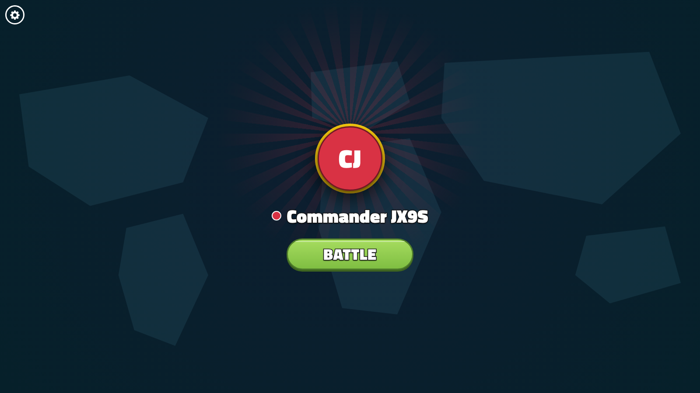
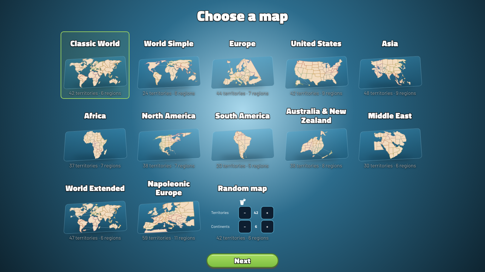
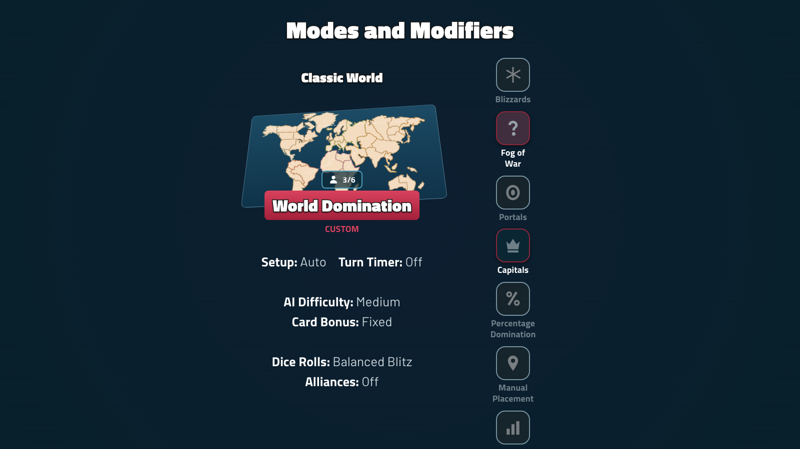
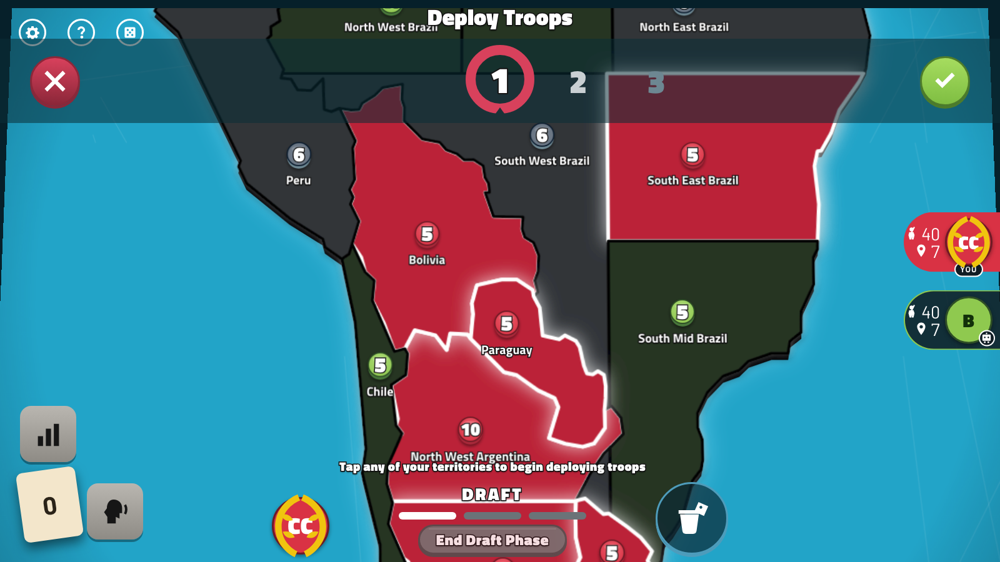
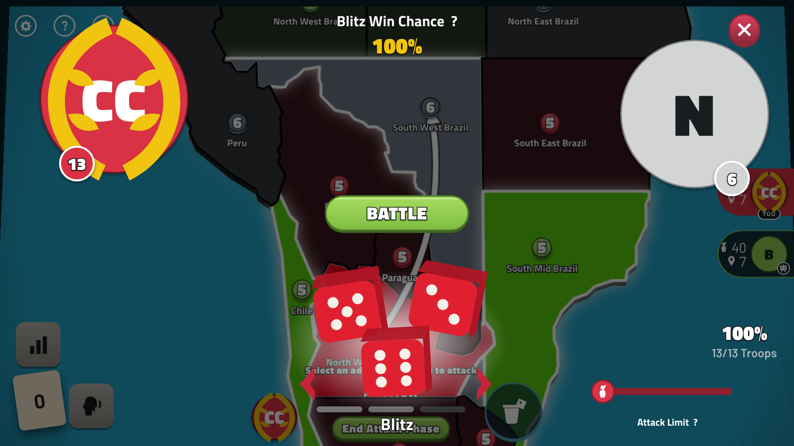
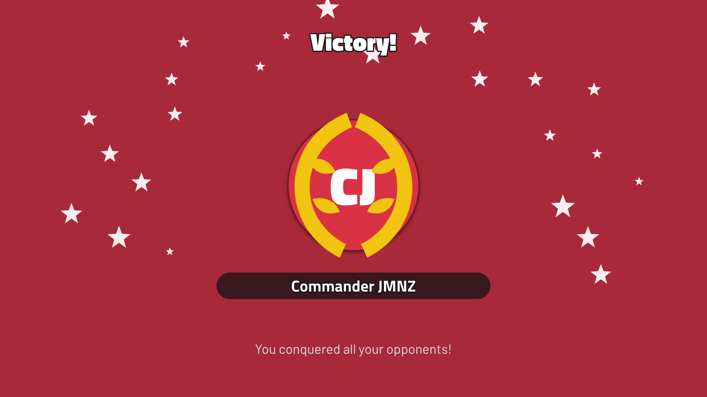

# Risk

> **the engine never rolls a die — the dice are already in the action log**

A browser rebuild of [RISK: Global Domination](https://www.smgstudio.com/risk) (SMG
Studio, 2019), the digital RISK with Balanced Blitz dice, Capitals, Fog of War and
Blizzards. The rules, the odds tables and the bot tiers were reconstructed from SMG's
own published numbers, the physical rulebook, and three hundred frames of store and
video evidence — because the game ships no rulebook and no source. Anyone who opens
the site can play: solo against five bot tiers, hot-seat for up to six on one device,
or a casual online game behind a four-letter lobby code. Sixteen boards, eleven
modifiers, forty-two chat lines and no free text anywhere.

| Home | Choose a map | Modes and Modifiers |
|---|---|---|
|  |  |  |

| Deploying troops | The Blitz view | Victory |
|---|---|---|
|  |  |  |

**The engine never rolls a die, and that is what makes the whole thing checkable.**
`apply(state, map, action)` is pure: no `Math.random`, no seeded generator, no clock —
a build-failing layering test reads `src/engine/**` off disk and enforces it. Every
random outcome arrives as *data inside the action that caused it*: the opening deal,
each card drawn, each battle's exact losses. So the action log is the game, and
replaying it with the same reducer must reproduce the authority's hash at every single
row. That is the first test in the suite and the one everything else leans on
(`e2e/replay.spec.ts`), and it is also why a cheating client is uninteresting: the
server rolls, the client folds, and a client whose fold disagrees drops its state and
refetches rather than arguing.

**Online play is a Postgres table and a polling loop, because that is what fits in a
free tier.** No WebSockets, no Durable Objects, no realtime vendor: one append-only
`actions` table behind ordinary route handlers, and clients that poll at 2 s on their
own turn, 4 s off it, 5 s in a lobby and 15 s hidden. Bot turns, turn timeouts, seat
takeovers and garbage collection all run **lazily inside whichever poll arrives
next**, so there is no cron and nothing to keep warm. A poll that finds nothing new
answers `204` with no body in about five milliseconds; a poll that finds one action
returns under a kilobyte. The measured envelope is in `SPEC.md` §6.4, and it is honest
about the limit: twenty players online an hour a day fits with a third to spare, and
twenty players online around the clock does not fit at all.

**Balanced Blitz is reproduced to fifteen decimal places from SMG's own published
examples.** SMG's dice mode reshapes the true battle distribution in four stages, and
the published description admits more than one reading — the readings differ in the
fifteenth decimal place, not in the shape of the curve, so no amount of re-reading
settles it. What settles it is their printed example: thirty attackers against a
capital held by fifteen, losing exactly twelve, is `0.0100282888709122` under Balanced
Blitz against `0.02221280017072782` under True Random. The implementation reproduces
both, plus forty-nine as the fewest attackers for an 80% Blitz against fifty, and
`20 v 15` as exactly 1. The test asserts fifteen places with `toBeCloseTo` rather than
`toBe`, because `Math.pow` appears twice in the pipeline and is not bit-identical
across JavaScript engines (D88).

**No legitimate RISK geometry exists, so every board here is either public domain or
generated.** The Wikimedia "Risk board" SVGs carry CC BY-SA tags despite being traced
from a retail Hasbro board the uploader never had rights to, and SMG's own artwork is
theirs. So the three ready-made boards (Classic World, World Extended, Napoleonic
Europe) come from a public-domain fan project's per-territory SVG paths, the nine
regional boards (Europe, the USA by state, Asia, Africa, the Americas, Australia and
New Zealand, the Middle East, a simple world) are generated from Natural Earth and
world-atlas data by a committed pipeline that dissolves countries into territories and
derives adjacency from shared borders, and a seeded Voronoi generator produces random
boards on demand. Every territory's shape is plain SVG path data under a per-ring
vertex budget, with a `polylabel` anchor inside it. Nothing in this repository is an
asset: the dice, the cards, the suit silhouettes, the emoji and the laurel wreath are
all geometry, colour and type (D38, D1).

Next.js 16 · a pure engine with an enforced layering rule · exact O(A·D) battle odds
to 128 troops and a fitted logistic beyond · **1,860 unit and property tests** ·
**10 end-to-end tests** across desktop and mobile Chrome · 16 boards · PostgreSQL only
for online play (WASM locally, Neon deployed). Built from 8 parallel research lanes,
then 7 parallel build slices, then four review rounds (one codex, three Claude) that
returned seventy findings, every one fixed.

## Index

| Path | What it is |
|---|---|
| [`SPEC.md`](SPEC.md) | The contract the code was built against: every rule with its number, the architecture, the HTTP surface, the screens, the tests, the slices |
| [`DECISIONS.md`](DECISIONS.md) | D1–D105, each with its reasoning and the evidence file it rests on |
| [`research/07-research-brief.md`](research/07-research-brief.md) | The consolidated brief — read this before touching a rule |
| [`research/`](research) | Eight lanes (repo conventions, core rules, maps and fan code, UX and dialog, visual design, bots and AI, online play on a free tier, the brief), plus the store screenshots and video frames |
| `src/engine/` | Rules, the reducer, resolvers, fog, hashing — pure TypeScript, no DOM, no clock, no randomness |
| `src/engine/odds/` | The battle DP, the fitted logistic, Balanced Blitz's four-stage reshape |
| `src/engine/bots/` | Five tiers, personas, scoring, the one-ply reply check |
| `src/engine/map/` | The map schema, the loader, the validator and the Voronoi generator |
| `src/content/maps/` | Sixteen boards as committed JSON, each under 100 KB, with their provenance |
| `src/render/` | The camera and its single projection, the board painter, the token layer, arrows |
| `src/game/` | The session runner, input gestures, autosave, the debug handle |
| `src/components/` | The one game screen, its dialogs, the setup flow, the lobby and the chat drawer |
| `src/net/`, `src/app/api/` | The polling adapter and every route in §6 |
| [`e2e/`](e2e) | Playwright: the replay proof, a solo game to victory, the hot-seat hand-off, two-player online, and the screenshot capture |

## Quick start

```bash
pnpm install
pnpm run dev          # http://localhost:3300 — no database needed for solo or hot-seat
pnpm run verify       # typecheck + lint + 1,860 unit tests
pnpm run test:e2e     # production build + Playwright on port 3300 (~5 min)
```

Solo and Pass & Play run entirely in the browser and keep progress in
`localStorage`. Online play needs Postgres: PGlite (Postgres compiled to WebAssembly,
in-process) is the default and needs no setup, and setting `DATABASE_URL` switches to
Neon.

## The game

**Rules in one breath.** Reinforcements are `max(3, floor(territories / 3))` plus the
classic continent bonuses, checked at your turn's start. The attacker rolls up to
three dice and the defender up to two, highest against highest, ties to the defender,
and you may only attack from a territory holding at least two armies. Take a territory
and you must move in at least as many armies as you rolled with. Hold five or more
cards at the start of your turn and you must trade a set down; the Fixed ladder is
4/6/8/10 with a +2 bonus for a territory you occupy, capped at two per turn, and
Progressive runs 4, 6, 8, 10, 12, 15 and then +5 forever. Fortify is one connected-path
move per turn and is optional. Eliminate a seat and you take its whole hand.

**Modes.** *Solo* against one to five bots. *Pass & Play* for two to six on one
device, with a full-screen hand-off between turns that conceals the board rather than
merely covering it. *Online*, two to six players, behind a four-letter lobby code
there is no friends list to manage.

**Modifiers**, all independent: Fog of War (you see what you hold and what you border,
and nothing else), Capitals (a capital gives its defender a third die and can be the
win condition), Blizzards (two to eleven frozen territories, out of play all game,
still paying their continent's bonus), Portals (stable or relocating every three
rounds), Percentage Domination (50–90%, default 70), Manual Placement, Max Rounds
(the 5-Rounds Rumble, decided on territories then troops), Round Delay, Alliances, the
choice between Balanced Blitz and True Random dice, and — for a two-seat game only —
the Neutral Army: the original's third, neutral holding, here **off unless asked for**
(D106).

**On the board.** Tap anywhere on a territory. The dice button is the Battle Log, every
battle of the game with who lost what and where (D108); the Continent Overlay repaints
the whole board by continent with the bonus badges riding the land (D109); the card
panel opens with the best set already picked (D110); a fortify ends the turn (D107);
eliminating a seat and inheriting your way to five cards sends you straight back to
the draft to trade (D114); and the red ✗ at the top-left — and on the victory frame —
goes home (D111).

**Bots.** Five tiers labelled as the original labels them — Beginner, Easy, Medium,
Hard, Expert. They differ by *policy*, not by arithmetic: every tier computes the same
scores, and a low tier blunders by picking the k-th best move rather than by
miscalculating, which is one code path instead of five. Expert spends its extra
compute on the draft and a one-ply reply check, sees through fog, and stops attacking
at a non-positive score. Each bot draws a persona at match start — aggression, reserve
factor, continent focus, grudge weight and five more — jittered ±10% so two games at
the same tier are not the same game.

**Chat** is forty-two preset lines in seven groups plus eight code-drawn emoji, shown
as a timed speech balloon beside the sender's roster capsule and appended to a log.
There is no free-text path anywhere in the app, and no column in the database for one
to land in.

## Controls

| Action | Mouse / touch | Keyboard |
|---|---|---|
| Select a territory | click / tap | — |
| Attack, fortify, deploy | click / tap a lit territory | — |
| Set a troop count | drag the slider, or tap a numeral | `1` `5` `0`, `←` `→`, `a` for all |
| Confirm / cancel a count | the ✓ and ✗ discs | `Enter` / `Esc` |
| Pan / zoom | drag / wheel, pinch | arrows or `WASD`, `+` `-`, `0` to reset |
| End the phase or the turn | the green pill | — |

## Architecture

```
src/engine        pure: types, rules, reducer, resolvers, fog, hash, odds, bots, maps
   ↑ apply(state, map, action) → { state, events } | { error }
src/game          session runner, input gestures, autosave, the __riskDebug handle
src/render        camera (the only projection), board painter, token layer, arrows
src/components    the one GameScreen, its dialogs, setup, lobby, chat
src/ports         SettingsPort, LocalProgressPort, IdentityPort, SyncPort
src/adapters      localStorage; PGlite (dev/e2e) and Neon (production) behind getDb()
src/net           the polling SyncPort adapter
src/app/api       session, lobby, lobbies/[code]/{join,leave,ready,start}, games/[id], chat
```

The engine publishes two contracts the rest of the app compiles against —
`src/engine/types.ts` and `src/engine/index.ts` — and both were written at their final
values, with every function body throwing, before a single rule was implemented, so
seven developers could build against them in parallel. `GameState` never enters React
state: the HUD subscribes to a derived UI slice and the board repaints itself from a
dirty flag, outside the render cycle.

## Online play

**Server-authoritative, append-only, polled.** A move is a `POST` that opens a
transaction, takes `FOR UPDATE` on the game row, folds the log, validates the action,
appends it with a canonical `state_hash`, and returns the row it just wrote — so the
submitter needs no extra poll to see its own move, and a retry with the same
`clientActionId` gets the same answer rather than a second row. Attacks go as
*intents*: the client asks to attack, the authority rolls. Every timeout, bot takeover
and reconnect is a row in the same log, never a silent side effect, so a client renders
"Napoleon is back" exactly as it renders a dice roll.

**Identity is a chosen display name behind a server-minted `httpOnly` cookie.** No
accounts, no passwords, no email. A name is yours while you are using it and is
released two minutes after you leave; claiming one that is taken returns `409` with
three suggestions rather than silently renaming you. A lobby is a four-letter code
from an unambiguous alphabet, meant to be read aloud.

**The cost envelope is the design constraint, not an afterthought.** Invocations per
player-hour are `3600 / interval`, so the adaptive mix comes to about 1,125 — which is
why the intervals are what they are, why a `204` carries no body, and why the
authoritative snapshot deliberately lags the log by up to fifty actions so that the
common poll returns a delta instead of a whole board (D100). The full table, with the
free allowances and what actually binds first, is `SPEC.md` §6.4.

## Deploying

The project is its own Vercel project (`risk-david`), deployed by hand from this
directory:

```bash
npx vercel deploy --prod --yes
```

`DATABASE_URL` comes from the Neon integration attached to the project. `vercel.json`
sets the build command to `pnpm run db:push && pnpm run build`, so the schema is
applied — idempotently — as part of every deployment. Locally, PGlite applies the same
schema on first boot (D102), so a fresh clone needs no database setup at all.

## What is verified, and what is not

- **Verified by tests.** Every rule in `SPEC.md` §3 has a fixture test. The replay
  proof folds a real online game's log and matches the authority's hash at every row.
  Balanced Blitz matches SMG's published digits to fifteen places, and the odds tables
  match their printed percentages cell by cell. All sixteen boards pass the validator,
  and each is under 100 KB. `fast-check` properties cover hash stability under
  round-trip, that `apply` never throws and never mutates, adjacency symmetry under
  every modifier combination, troop conservation, and that `viewFor` never leaks a
  hidden owner, a hidden count or another seat's hand. End to end, the suite plays a
  solo game from the menu to a victory on desktop and on a phone viewport, drives a
  six-seat hot-seat hand-off with Fog of War and checks that the two seats genuinely
  see different boards, and takes two online players through a lobby, a turn each, chat
  both ways, a turn-timer takeover and a reclaim.
- **Smoke-tested, not asserted.** The nine generated regional boards are validated but
  their *play balance* is a judgment, not a measurement. The visual design matches the
  evidence frame by frame in geometry, but every animation duration and easing curve is
  an invention calibrated to the art (D72) — the evidence set is entirely still frames,
  which can prove an animation exists but never how it moves.
- **Found by the suite and fixed.** The first online spec could not tap the board after the
  lobby hand-over; the cause was the board rebinding its pointer listeners on every resize
  tick, so a tap that spanned a resize was lost (D105). Every dialog had rendered unscaled on
  phones because the stage's `scale()` was given a length, and the action bar intercepted the
  bottom-left stack at phone width; all three are fixed and the mobile project of the suite
  now taps through them.

## Known gaps

The `CAPTURE=1` screenshot pass has one flaky capture: *the victory overlay* races a
percentage-domination win inside fourteen turns on a random per-game seed and lands
about half the time. The default suite does not run it; re-run the capture if that one
frame is missing.


Deliberately out of scope, each for a stated reason in `DECISIONS.md`: Zombies (every
gameplay number unverified — though its two dice augments stay wired into the model,
D75), Secret Missions, Secret Assassin, teams, ranked play and the class ladder, gems
and premium packs, every cosmetic, DLC maps (**every map here is free**), the friends
list, the replay viewer, spectator mode, Basic Training's guided tutorials, and the
Exponential and Per-Player card modes. Also absent: accounts, cloud sync, a
leaderboard, localisation, and a push transport — the `SyncPort` exists so that SSE or
a notification bus is one adapter away, and it is deliberately not built.

Card secrecy online is a UI property, not a security one: a non-fog game sends the
authoritative state so the client can fold it, which means another seat's hand is
visible to anyone reading their own network traffic. Hiding it properly needs an
unknown-card state model, which is a feature rather than a patch (D93). Fog of War is
the mode that actually withholds information, and it does so by sending a masked view
with a redacted action list instead of a foldable log (D94).

## What this is

A non-commercial portfolio replica, built from research alone: no decompiled code, no
extracted assets, no rulebook from the publisher. **RISK is a trademark of Hasbro**,
and *RISK: Global Domination* is SMG Studio's game; this project is affiliated with
neither and contains no Hasbro or SMG artwork, board geometry or licensed code. Every
map traces to a public-domain or permissively licensed source, and the one tempting
shortcut — the CC BY-SA-tagged Risk board SVGs on Wikimedia, which were traced from a
retail board the uploader had no rights to — was refused on the record (D38). The
`research/` folder is the argument for every choice; where the evidence ran out,
`DECISIONS.md` says so.
