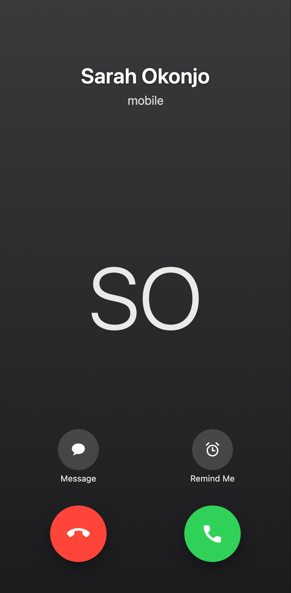
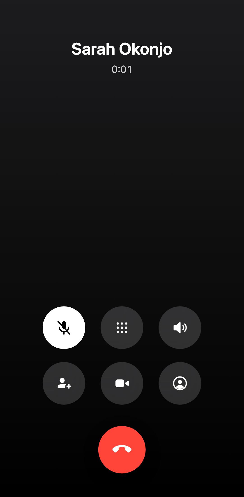
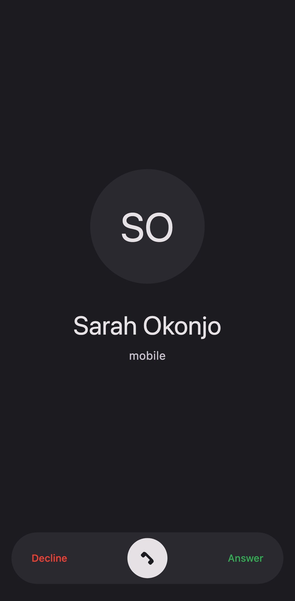
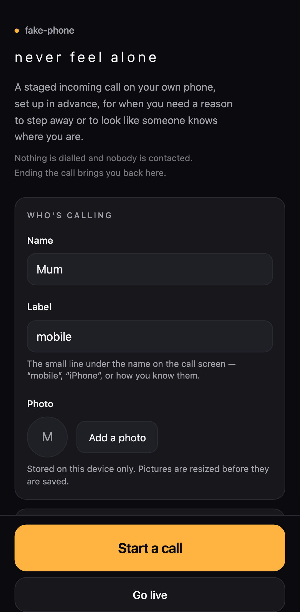
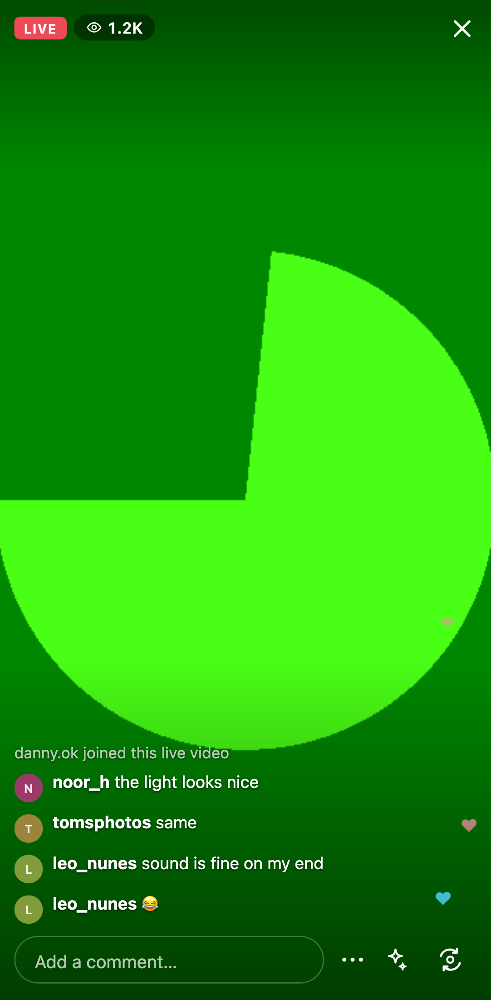
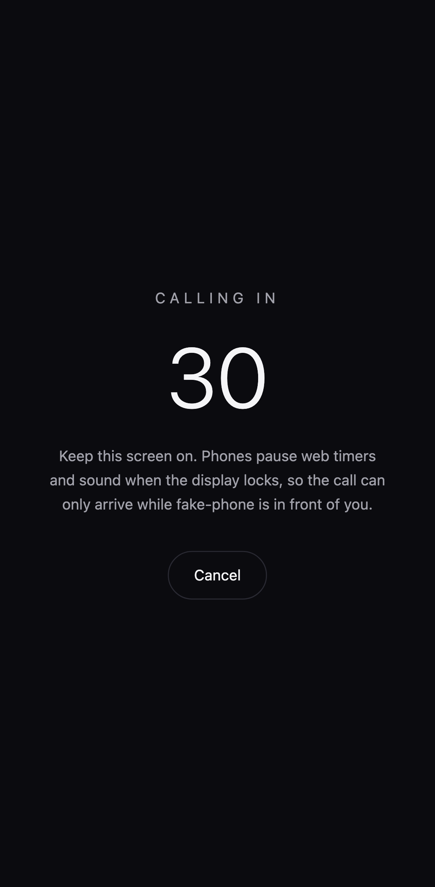

# fake-phone

> **never feel alone**

A personal-safety web app. When someone feels uneasy — walking home, waiting for
a ride, stuck in a conversation they want out of — they open fake-phone and a
call arrives. To anyone watching, someone knows where they are and is on the way.

It is a **replica**: the call screen is a faithful reconstruction of the iOS and
Android phone UIs, and the live-stream mode reconstructs the broadcast chrome
every streaming app shares. Built as a one-shot, research-first exercise — six
parallel research lanes, then six parallel build slices, against a frozen
contract.

|  |  |  |
|---|---|---|
|  |  |  |
| iOS incoming | iOS in-call (mute engaged) | Android swipe-to-answer |
|  |  |  |
| Home / settings | Live-stream mode | Delayed ring |

---

## Index

| Path | What's in it |
|---|---|
| `SPEC.md` | The build spec, derived from `research/` |
| `DECISIONS.md` | Every non-obvious choice, with the reasoning and the rejected alternatives |
| `research/` | Six research lanes, each claim tagged HIGH/MED/LOW confidence |
| `research/ios-call-ui.md` | Pixel spec for the iOS call screens |
| `research/android-call-ui.md` | Pixel spec for Material 3 Expressive / Google Phone |
| `research/instagram-live-ui.md` | Live-broadcast chrome, plus the trademark line |
| `research/competitive-teardown.md` | Existing fake-call apps, and the App Store policy that binds this one |
| `research/web-platform-constraints.md` | What mobile Safari will and will not let a web app do |
| `research/ai-voice-architecture.md` | Provider comparison and the voice-tier design |
| `src/domain/` | Pure logic — call state machine, formatting, settings, personas, live session |
| `src/ports/` | The interfaces every platform quirk hides behind |
| `src/adapters/` | Browser implementations (audio, speech, camera, storage, voice providers) |
| `src/components/call/ios/` · `android/` | The two call skins |
| `src/components/live/` | Live-stream mode |
| `src/components/home/` · `settings/` · `ui/` | Our own surfaces |
| `src/app/api/voice/` | The AI tier's server routes (inert without a key) |
| `src/lib/container.ts` | The composition root — the only module that names an adapter |
| `scripts/generate-audio.mjs` · `generate-icons.mjs` | Original ringtone and icon generation, zero dependencies |
| `e2e/` | Playwright suites, plus the screenshot capture spec |

---

## Usage

```bash
pnpm install
pnpm run dev          # http://localhost:3000
```

The app opens **into a ringing call**. That is the product, not a shortcut:
someone opening it is usually already in the situation it exists for.

- **Answer** — the call connects, the timer starts, and the caller begins
  speaking their side of the conversation.
- **End the call** (or decline) — this is the only way into the home screen and
  options. It doubles as cover: a bystander sees a call being ended, not a
  settings menu being opened.
- **Start a call** / **Go live** — from the home screen.

### What you can configure

Caller name, relationship label and photo · call skin (iOS / Android) · voice
tier · persona · ring delay · auto-answer · ringtone on/off · subtitles on/off ·
live username, avatar, starting viewer count and comment rate.

Everything is stored on the device in `localStorage`, and photos are downscaled
to 512px before being saved.

### The three voice tiers

| Tier | What you hear | Needs |
|---|---|---|
| **Silent** | Nothing — photo, name, ringtone and a live timer | nothing |
| **Scripted** *(default)* | A written half-conversation spoken aloud, with realistic listening pauses | nothing |
| **AI** | A live LLM-driven conversation | an API key |

### Enabling the AI tier

The AI tier ships **fully wired and completely inert**. Every interface, route,
registry entry and env var exists; with no key the factory silently returns the
scripted provider and the routes answer `503 { code: "voice_unconfigured" }`.
To light it up:

1. `cp .env.example .env.local`
2. Set `ANTHROPIC_API_KEY=…`
3. Set `NEXT_PUBLIC_VOICE_AI_ENABLED=true`
4. Rebuild (step 3 is inlined at build time)
5. Choose the **AI** voice tier in settings

No code change and no new dependency. The key is read server-side only and never
reaches the browser. `VOICE_SESSION_SECRET` is optional: session tokens are signed
with a key derived from the provider's API key unless you set it, so setting it
is only worth doing if you rotate that key and would rather not cut live calls a
few minutes short.

If the AI tier is selectable but the server cannot actually serve it — no key,
a rejected key, `VOICE_PROVIDER=scripted` — the call does not fail. The client
flag is build-time, so only the first request finds out; when AI fails to
connect, the call runs on the **scripted** provider instead, and if that fails
too it still connects and runs silently. A phone stuck on "connecting" is a
phone that is visibly not on a call, which is the one outcome this app cannot
afford.

---

## Scripts

| Command | Does |
|---|---|
| `pnpm run dev` | Dev server |
| `pnpm run build` / `pnpm start` | Production build / serve |
| `pnpm test` | Unit tests (363) |
| `pnpm run test:e2e` | Playwright, three projects (mobile Safari, mobile Chrome, desktop) |
| `pnpm run typecheck` · `pnpm run lint` | TypeScript · ESLint |
| `pnpm run generate:assets` | Regenerate the ringtone WAVs and the PWA icons |

Refresh the screenshots in this README with:

```bash
CAPTURE=1 npx playwright test screenshots --project=mobile-chrome
```

---

## Architecture

```
components/  →  domain/  ←  adapters/  →  ports/
      ↘            ↑                      ↗
       lib/container.ts   (the only module that constructs adapters)
```

- **`domain/`** is pure: no DOM, no React, no SDK. The call state machine, the
  timer formats, the dialogue engine and the live-session model are all tested
  without a browser.
- **`ports/`** are interfaces. Every hostile platform behaviour is quarantined
  behind one, so the day `navigator.vibrate` ships in Safari — or the day this is
  wrapped in Capacitor — the change is one adapter and one line in the container.
- **A component may never import an adapter.** It gets ports from the container.
- **A skin is a pure renderer** over one view model, so the iOS and Android
  screens can differ in appearance but never in behaviour. One e2e suite drives
  both through shared test ids.

`DECISIONS.md` explains why each of these is the way it is.

---

## Deploying

### Vercel

Zero configuration — import the repo, set the root directory to `fake-phone/`,
and deploy. Next.js is detected automatically. `next.config.ts` already sets the
headers the PWA needs (`no-store` on `sw.js`, the right content type on the
manifest).

Set no environment variables and the app is fully functional; the AI tier stays
dark. If you use Vercel's deployment protection, exclude `/manifest.webmanifest`
and `/sw.js` or the app will not be installable.

### Locally, on a real phone

The camera and installability both need a secure origin, so `http://<your-lan-ip>:3000`
will not do:

```bash
pnpm run build && pnpm start
npx untun@latest tunnel http://localhost:3000   # or ngrok / cloudflared
```

Open the HTTPS URL on the phone → Share → **Add to Home Screen**. Launched from
the home screen it runs full-screen with no browser chrome, which is what makes
the replica land.

---

## Known gaps

Honest list. Some are platform limits, some are scope.

**Platform limits we cannot fix from the web**

1. **A delayed call only rings while the screen is on.** Mobile Safari suspends
   timers and audio when the display locks. The ring delay is capped at 60s and
   the UI states the constraint rather than failing silently — this is the single
   most common one-star review in this app category. Real background triggering
   needs Web Push plus a backend (and iOS Web Push cannot play a custom sound), or
   native local notifications.
2. **No haptics on iOS.** `navigator.vibrate` has never shipped in Safari. The
   `Haptics` port is a no-op there; real haptics arrive with a native wrapper.
3. **The first ring may be silent.** A cold-booted tab has no user activation, so
   the ringtone is blocked until the first touch anywhere (the app listens for it).
   Arriving via "Start a call" avoids this entirely, because that tap unlocks audio.
4. **Speech quality is the device's.** The scripted tier uses the platform speech
   synthesiser; iOS voices are serviceable, not cinematic. Subtitles are on by
   default so the call still reads as real when nothing is audible.

**Built but not lit**

5. **The AI tier needs a key** (see above). Only the Anthropic path has a client;
   the OpenAI seam is declared but empty.
6. **The AI tier speaks; it does not listen.** There is no speech-to-text in this
   build, so the caller talks and reacts to the script rather than to you. That
   matches what a one-sided fake call actually is, and it is why the scripted
   tier is nearly as convincing as the AI one — but "a live conversation" means
   the *model* is generating the caller's side live, not that it hears you. The
   seam where STT would attach is marked in the voice adapter.
7. **A finished script does not hang up.** When the caller's lines run out the
   call stays connected and the timer keeps running, because that is what a real
   call does — the person who wanted out is the one who ends it. It is a
   deliberate choice, not a missing transition.
8. **No ephemeral-token/WebRTC path.** `/api/voice/session` returns
   `ephemeralToken: null` with the exact three steps documented in place. A true
   speech-to-speech provider is a branch in that handler plus a transport in the
   adapter — not a contract change.
9. **Token accounting is per-instance and best-effort.** The session itself is a
   signed token, so the *duration* cap is exact on every serverless instance with
   no shared state. The token ledger and the rate limiter are in-memory, so a
   call whose turns land on N instances can spend up to N times its token budget.
   Shared storage (Vercel KV, Redis) is what makes the token side exact.
10. **Offline is verified manually, not in CI.** The service worker only
    registers in production builds and Playwright runs against `pnpm run dev`, so
    the offline path was proved by hand against `next start` (13 `/_next/` assets
    cached; an offline reopen hydrates and navigates) rather than by a test.

**Scope**

11. **No App Store build yet.** The path is Capacitor around this same codebase —
   see below. Nothing here is architected in a way that blocks it.
12. **Contact photos only, no contact import.** Deliberate: reading the address
   book is a permission this app does not need.
13. **One-sided audio only.** The AI tier speaks and listens through the browser;
    there is no telephony anywhere, by design.
14. **The M3 colour tokens are MED-confidence.** `m3.material.io` is a JS-rendered
    SPA that could not be scraped, so the Android palette comes from
    well-published AndroidX values rather than a live source. Spot-check before
    treating them as final.
15. **Screenshots are captured on Chromium** with a synthetic camera, so live
    mode shows a test pattern rather than a face.

---

## The App Store path

The wrapper is **Capacitor around this codebase** — not a rewrite, and not a
plain WebView shell (Apple rejects those under Guideline 4.2 as repackaged
websites). What the wrapper must add to be a real app, in priority order:

1. `@capacitor/local-notifications` — the big one. Real OS-scheduled calls with a
   custom sound that fire even if the app is killed, which resolves gaps 1 and 3
   outright.
2. `@capacitor/haptics` — gap 2.
3. A native `AVAudioSession` background-audio configuration.
4. Offline asset bundling.

**Positioning is a hard constraint, not a preference.** App Store Review
Guideline 1.1.6 bans prank-call apps outright and explicitly refuses
"entertainment purposes" as a defence; Google Play's Deceptive Behavior policy
matches it. So: no "prank", "joke" or "trick" language anywhere in the product,
the listing or the screenshots; the app never claims or implies contact with
emergency services; and it only ever calls *you*. Self-directed fake-incoming-call
safety apps are a live, approved category — apps that anonymise calls to other
people are not.

---

## What this is not

fake-phone does not contact anyone, does not dial, does not reach emergency
services, and cannot summon help. It is a deterrent and a way out of a
conversation. **If you are in danger, call your local emergency number.**
