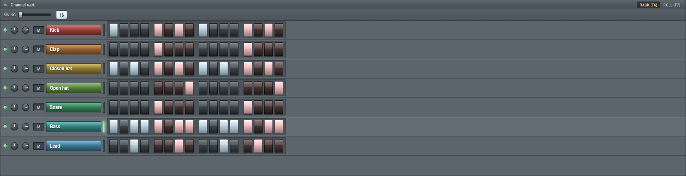
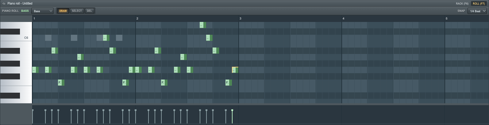
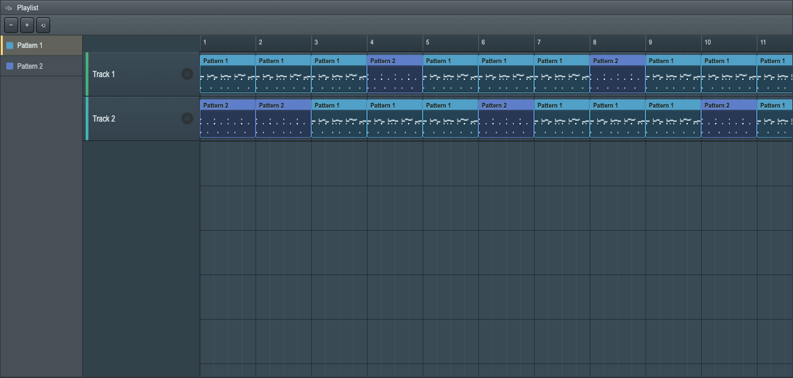
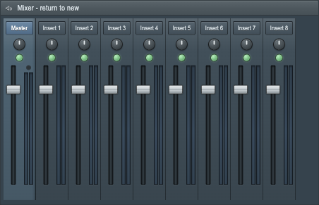
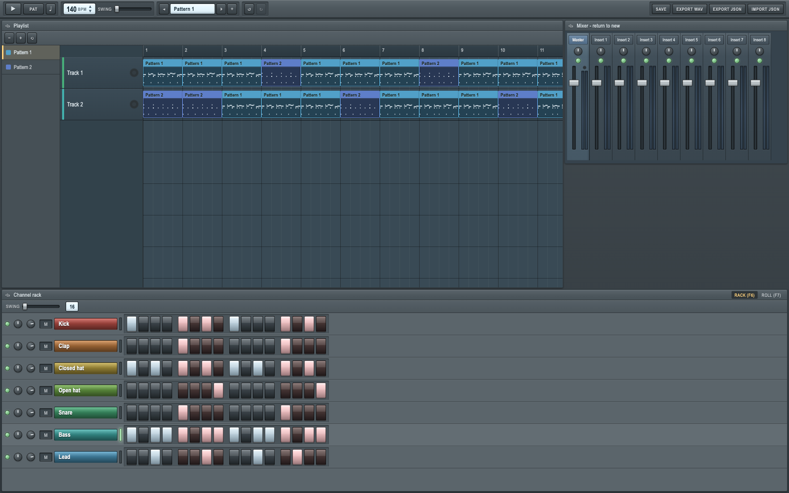

# FL Studio — the beat, not the DAW

> **program it, arrange it, hear it, save it**

A browser rebuild of [FL Studio](https://www.image-line.com/fl-studio/)'s core
sequencing loop — the Channel Rack, the Piano Roll, the Playlist, a minimal
Mixer and the transport that drives all four. Not full DAW parity: the one
workflow that made FL what it is, built properly.

The whole project passes or fails on a single sentence, and every cut was made
against it: **program a 16-step drum pattern, add a bassline in the piano roll,
arrange two patterns into a song, hear it through a master fader, save it,
reload it.**

**Every sound you hear is synthesized from oscillators, noise and filters at
runtime.** Not one sample file ships. Not one Image-Line asset is in the repo or
the bundle.

| Channel Rack | Piano Roll | Playlist |
|---|---|---|
|  |  |  |

| Mixer | The whole thing |
|---|---|
|  |  |

```bash
pnpm install && pnpm dev     # http://localhost:3000 — no keys, no database, nothing to configure
```

Press **Play**. That first click is what creates the `AudioContext` — the whole
audio engine is lazy and gesture-gated, because Chrome will not let it be
anything else.

---

## Deploy on Vercel

Zero config. Import the repo in Vercel and set the project **Root Directory** to
`fl-studio`. That is the entire setup: no environment variables, no database, no
API routes, no server actions. The app is client-side from the first frame, so
every route prerenders as static content and the CDN serves the rest.

The package folder is `fl-studio` with no space. Vercel names serverless
functions from that path, and a space in the name fails the deploy. Local
Turbopack still needs `fileURLToPath` because the parent `Personal Projects`
directory has a space.

## Test locally

```bash
pnpm install
pnpm dev                     # http://localhost:3000
PORT=4000 pnpm dev           # or anywhere else
```

| Command | What it does |
|---|---|
| `pnpm test` | 1,256 unit tests across 39 files (vitest, jsdom) |
| `pnpm test:e2e` | 15 Playwright end-to-end tests across 6 spec files |
| `pnpm test:e2e:ui` | The same, with the inspector |
| `pnpm verify` | `tsc --noEmit` + eslint + the unit suite |
| `pnpm build` | Production build |
| `pnpm start` | Serve the production build |

The first e2e run needs a browser:

```bash
pnpm exec playwright install chromium
```

---

## Steps are notes

This is the one architectural bet, and everything else follows from it:
**the step grid and the piano roll edit the same list.**

FL Studio has no separate `Step` entity, and neither does this. A Channel Rack
step is a `Note` with `lengthTicks: 0` at a quantized tick position — toggling a
step upserts or deletes a note in `Pattern.notes`, which is the exact list the
piano roll draws. Open the piano roll on a drum channel and the steps you
clicked are there, as notes, because they always were.

Positions are **integer ticks at PPQ 96** — 24 ticks to a step, 384 to a bar —
never step indices. A step index is simpler for the rack alone and cannot
represent a single thing the piano roll exists to do: a note that is three
sixteenths long, a note dragged off the grid with Alt held, a swung off-beat.
Store an index and you need a second coordinate system beside it within a day.
Every surface converts tick↔pixel through `tickMath.ts` instead of reading a
number off the model, which is the cost, and it is paid back the first time a
bassline needs a note that is not exactly one step long
([D1](design-decisions.md), [D2](design-decisions.md)).

Swing is applied **at scheduling time only** — an off-beat step gets a delay
added as it is queued. The stored tick is never rewritten, so turning swing back
down returns the pattern exactly, and the number in the file is still the number
you drew.

---

## Nothing is sampled, and that was a licensing decision

The obvious way to get a kick, a clap and a hat that sound good on the first
pass is a handful of "royalty-free" 808/909 one-shots. Research lane 4 went
looking for a clean source and found the trap instead: **Freesound's own FAQ
states that the TR-909's PCM cymbal and hi-hat samples may still carry Roland's
copyright** even after being re-recorded and redistributed as royalty-free. The
TR-808 is fully analog and has no such problem, but the distinction is invisible
in a pack labelled "808/909 drums", and there is no partial version of "no
assets ship" — the moment one `.wav` lands in the repo, the posture is gone.

So the door was closed before any voice existed. Seven voices — kick, clap,
closed hat, open hat, snare, bass, lead — built directly on
`OscillatorNode` / `GainNode` / `BiquadFilterNode`, plus one white-noise
`AudioBuffer` generated in code rather than loaded. The kick is a sine with an
exponential pitch drop; the hats and snare are filtered noise with short gain
envelopes. They will never punch like a sampled 909, and that is the trade:
a repo with zero licensing exposure and a README that can say "all audio is
synthesized at runtime" without an asterisk ([D4](design-decisions.md)).

**Tone.js is the clock and nothing else.** Its `Transport` handles what is
genuinely hard — sample-accurate look-ahead scheduling, BPM as a live signal,
loop bounds, seek — and reimplementing that is engineering risk this project did
not need. But every voice is a native node against
`Tone.getContext().rawContext`, never a `Tone.Synth` preset, so the sound is
ours and so is the licensing story. One context, one clock; `new AudioContext()`
appears nowhere ([D3](design-decisions.md)).

The rest of the engine is lane 3's recipe, taken verbatim:

- **A fixed 8-voice pool per channel**, oldest-first stealing.
- **Choke groups across channels** — a closed hat cuts a ringing open hat. It
  deliberately never chokes *itself*: a channel retriggering is ordinary voice
  stealing, already handled, and folding the two together would double up
  ([D14](design-decisions.md)).
- **Every release is a gain ramp, never a hard stop**, because a hard stop is a
  click.
- **Velocity scales the note's own envelope**, not the channel's gain node — so
  two notes at different velocities overlapping on one channel are each correct,
  instead of the second one retuning the first ([D15](design-decisions.md)).
- `voice → channel gain → panner → mixer-track gain/panner → master gain →
  a compressor as a limiter → destination`, with **`AnalyserNode` taps hanging
  in parallel** off each strip and the master. Meters read
  `getFloatTimeDomainData()` per animation frame; nothing that only draws a
  picture sits in the signal path.

---

## Made to look like FL, by measuring it

Lane 1 did not eyeball the screenshots. It ran **horizontal pixel run-length
scans across Image-Line's own manual captures** and read the geometry off them:
a step cell is **20 × 32 px with a 4 px gutter — a 24 px step pitch** — and it is
portrait, not square, which is most of why a generic step sequencer never quite
reads as FL.

Three findings from that lane are load-bearing:

**The 4-step grouping is a hue alternation, not a checkerboard.** Steps 1–4 and
9–12 are cool slate, 5–8 and 13–16 are warm rose, on the buttons themselves —
and the "on" state is a high-value tint of *that group's* hue rather than one
shared highlight colour.

**The piano roll's shading is two-dimensional.** Black/white key row tint,
multiplied by a per-beat column tint, crossed by **three separate gridline
weights** — step, then beat with a lighter flank beside it, then bar, each
darker than the last. The gridlines are 1px `fillRect`s rather than strokes, because a stroked hairline
straddles the pixel boundary and blurs — and blurred is the same as absent when
the whole point is that the three weights are distinguishable.

**A playlist clip is a header strip over a live miniature**, not a coloured
rectangle with a label. Lane 1 names the flat-rectangle version as the single
most common way a replica reads wrong.

Every one of those values is a token in a CSS custom-property sheet, never a hex
in a component, because FL itself ships a theme editor and hard-coding `#4E585E`
through the tree would be un-FL-like on top of being bad practice. Two caveats
are recorded honestly rather than papered over: Image-Line publishes no hex list
for the random channel/pattern colour palette (this one invents an HSL-clamped
equivalent, S 35–60%, L 45–65%), and the manual's captures may be at 125% or 150%
Windows DPI — so the **ratios** are trustworthy and the absolutes are adopted as
"our 100% zoom" rather than claimed as FL's.

The piano roll is **one `<canvas>` 2D painted by a pure function**. The painter
takes a minimal `DrawSurface` — the smallest slice of
`CanvasRenderingContext2D` it actually needs — a viewport and a plain scene
object, and touches neither the DOM nor the store, so the entire renderer is
unit-tested against a recording fake with no `node-canvas` and no jsdom canvas
shim. Signal, the closest public prior art, uses WebGL; that solves a
multi-track-MIDI-editor scale problem this project does not have, and the
painter sits behind one interface so the escape hatch stays open
([D5](design-decisions.md)). The rack, playlist and mixer are ordinary DOM,
because tens of rows by sixteen steps is nowhere near canvas territory
([D6](design-decisions.md)).

---

## A clip is a reference, and you can see that it is

Paint a pattern into the playlist twice, then edit it in the rack: **both
miniatures redraw, live.** That is FL's entire arrangement workflow — edit once,
every placement follows — and it is the thing a naive "drag pattern onto
timeline" implementation gets wrong by default, because copy-on-place is the
easier code.

Reference semantics have to be *visibly* true or they read as a bug rather than
a feature, so it is a first-class e2e scenario, not an implementation detail:
any code path that snapshots note data at paint time — a plausible miniature
cache, say — silently reintroduces copy-on-place and the test catches it.
**Make unique** is the one explicit fork, and it lives on the clip *header's*
context menu — right-clicking a clip's body is the universal erase gesture, so
the menu could not sit there: clone the pattern, repoint that single clip, one
undoable command ([D11](design-decisions.md)).

**Undo covers everything**, via command objects with `apply`/`invert`, and a
drag gesture coalesces into one history entry. That coalescing carried the
project's best bug. The first version kept the *first* dispatch's inverse for
the whole gesture — "the first inverse already undoes back to the start" — which
is true only when every coalesced command overwrites the same field, like a knob
drag. Painting four notes across four different pitches undid to *three* notes,
because the entry's only inverse removed the first one. The fix folds inverses
in the **reverse** order their commands were applied, so each lands exactly on
the state the previous one was captured against. `undo.ts` carries a load-bearing
comment about why, because the wrong version compiles, typechecks, and passes any
test that only exercises a knob ([D9](design-decisions.md)).

Navigation is the deliberate exception: switching patterns and pressing `L` are
persisted but never pushed onto the stack, because flipping between two patterns
while auditing a song would flood the history and make `Ctrl+Z` undo *browsing*
instead of your last edit ([D10](design-decisions.md)).

---

## Saving it, and getting it back out

Autosave writes one `SaveFile { schemaVersion, project }` to `localStorage` under
`fl-studio:project:v1`, **debounced 750 ms so a drag writes once at the end**
rather than `JSON.stringify`-ing the project on every mousemove. The Save button
writes immediately and there is an e2e test asserting exactly that — that it
beats the debounce.

The deserializer rebuilds every entity field by field instead of casting, and
splits failure into two classes. **Structural** nonsense — not an object, no
patterns, an unknown `schemaVersion` — returns `null` and the app falls back to
the default project. **Referential** damage — an orphan clip pointing at a
deleted pattern, a missing Master strip, an `activePatternId` aimed at nothing —
is repaired in place, because losing a whole song over one dangling clip is the
worse failure. That split is what stops "repair" from degrading into "accept
anything". A `migrate()` dispatch table exists from day one as a v1→v1 identity
function, purely so the second schema version is not the first migration ever
written under pressure ([D16](design-decisions.md)).

The same envelope is the JSON export and import format. **WAV export** rebuilds
the compiled song-mode event list against a plain `OfflineAudioContext`,
re-using the very same voice constructors — they take a `BaseAudioContext` and
never depended on Tone's realtime machinery, so they work offline unmodified —
renders, and encodes 16-bit PCM by hand ([D12](design-decisions.md)).

---

## How it was built

**Seven research lanes, in parallel**, ~3,300 lines in
[`research/`](research), before a line of application code: visual and
interaction design, the data model, audio-engine architecture, sound sourcing
and licensing, comparable prior art, the UX scope boundary, and stack fit. Every
claim is tagged **HIGH** (primary source, quoted), **MED** (secondary,
corroborated) or **LOW** (inference, flagged) — the gaps above are the LOWs,
reported rather than smoothed over.

**Then seven build slices, in parallel**, plus integration: domain + store ·
audio engine · shell/theme/transport · Channel Rack · Piano Roll · Playlist ·
Mixer. File ownership was disjoint and seams were extended by **composition, not
co-editing** — the zustand store is a composer, each surface lands its own
`uiState.ts` and asks for a one-line registration; the global theme sheet holds
global tokens only and per-surface tokens live with their surface; the keyboard
map is a registry each surface calls into ([D8](design-decisions.md)). That is
the mechanism the parallel build actually depended on, not a state-management
preference: a monolithic store file is a guaranteed conflict between every pair
of agents.

The layering rule is enforced by a test that walks the import graph:
`src/domain` imports nothing from React, Next, Tone or any browser API, and
`src/audio` imports only `src/domain`. The engine therefore cannot read the
store — the store pushes to it, calling `syncProject(project)` and re-arming the
transport only when the compiled schedule actually changed, so a fader tweak
does not glitch playback ([D13](design-decisions.md)).

**Then twenty rounds of codex review, run to a clean pass.** Most of what they
found lived in one subsystem — pointer gestures and the undo entries they open —
and it did not yield to fixing the reported case, because the next round simply
found the same shape somewhere else. It closed to class-level sweeps instead:
**one mutating gesture at a time app-wide** rather than per-surface guards
([D19](design-decisions.md)), **pointer ownership consulted on every event** so a
stray second pointer cannot drive or seal a drag it does not own, **sessions
scoped to a press token** rather than to a pointer id that a mouse keeps for
life, **pending editor commits flushed before a new gesture's first dispatch**
instead of waiting for `blur` to arrive too late ([D20](design-decisions.md)),
and **structural no-ops dropped at dispatch** so a gesture that changed nothing
leaves no undo entry behind ([D21](design-decisions.md)). The unit suite roughly
doubled over those rounds, which is the honest measure of how much of this was
invisible to the first one.

---

## Code index

```
SPEC.md                        the contract all seven slices built against
design-decisions.md            22 decisions, each with its rejected alternative
research/                      seven lanes, ~3,300 lines
  00-research-brief.md           what each lane had to establish
  01-visual-interaction-design.md  measured geometry, colour tokens, gesture vocabulary
  02-data-model.md               entities derived from observed behaviour
  03-audio-engine.md             look-ahead scheduling, Tone.js verdict, signal chain
  04-sound-sourcing-licensing.md the 909 trap, and the synthesis-only recommendation
  05-prior-art.md                Signal, GridSound, ToneMatrix — what to reuse and avoid
  06-scope-boundary.md           the IN/OUT list, feature by feature
  07-stack-deployment.md         stack fit, jsdom's missing Web Audio, the folder space
```

| Path | What lives there |
|---|---|
| `src/domain/` | `types.ts` (entities + tick constants), `commands/` (every command, apply/invert, coalescing), `tickMath.ts`, `compile.ts` (project → event lists), `serialization.ts`, `defaultProject.ts`, `layering.test.ts` |
| `src/audio/` | `engine.ts` (lazy boot, transport), `scheduler.ts` (events → Transport, swing, metronome), `voices/` (seven recipes + the shared noise buffer + the pool), `mixerGraph.ts`, `exportWav.ts` |
| `src/lib/` | `store.ts` (the zustand composer, dispatch/undo, debounced autosave), `theme.css` (global tokens), `keyboard.ts` (binding registry) |
| `src/components/` | `shell/` · `transport/` · `channel-rack/` · `piano-roll/` (renderer, geometry, interactions) · `playlist/` · `mixer/` |
| `e2e/` | the beat loop, piano roll, playlist, mixer, persistence, smoke |

**The rack is editable, not a fixed roster.** `+` adds a channel from the seven
voices, and right-clicking a channel's name opens FL's Channel Operations menu —
Rename, Recolor, Move up, Move down, Delete. Rename is an inline box that commits
on `Enter` or blur and refuses a blank or unchanged name rather than pushing an
undo entry for nothing. The transport carries the project-level pair beside Save
and the two exports: **New** and **Load**, both two-click armed, because either
one throws away whatever is on screen.

**Keyboard:** `Space` plays and stops from any window · `L` toggles Pattern and
Song mode, which changes what the whole app means · `Ctrl+Z` / `Ctrl+Shift+Z` /
`Ctrl+Y` undo and redo · `Ctrl+S` saves · `Ctrl+H` panics, stopping the transport
and every scheduled voice · `Ctrl+M` toggles the metronome, which the toolbar also
carries as a button · `F2` renames the current pattern, `F4` jumps to the next
empty one, `Numpad +/-` steps between them · `F5` and `F9` show and hide the
Playlist and the Mixer, `F6`/`F7` flip the bottom panel between Rack and Roll ·
`PgUp`/`PgDn` zoom the piano roll about the grid centre. And the three FL
primitives, everywhere they apply: **right-click deletes**, middle-drag pans on
both axes, `Ctrl+wheel` zooms at the cursor.

None of those fire while you are typing: the registry skips every binding whose
`worksInInputs` is not explicitly set when the event came from a text field, or
`140` in the BPM box would mute channels 1, 4 and 10. The guard protects *text*,
not focus — a range slider has no character to steal, and treating it as text
entry silently killed `Ctrl+Z`, `Ctrl+S` and `Space` for as long as the swing
slider held focus.

---

## Known gaps

1. **Patterns are fixed at 16 steps** for v1. The data model is tick-based and
   does not care, so this is a UI cap, not a modelling one.
2. **No floating windows.** FL's draggable panels are replaced by a fixed docked
   layout — a window manager is real complexity (z-order, drag, resize,
   collision, persisted rects) in service of nothing musical, and layout state is
   deliberately kept out of the saved project so a later pass could add it
   without a migration ([D7](design-decisions.md)).
3. **No FX ladder, no send graph.** Each channel routes to exactly one mixer
   track; every track sums straight to master. Cut entirely rather than shipped
   as inert chrome.
4. **No recording, no MIDI input, no audio clips, no automation clips**, and
   `.flp` compatibility was never in scope.
5. **The drums are synthesized and sound like it.** See above — that is the
   deal, not an oversight.

---

## Project description

**FL Studio** is a browser rebuild of FL Studio's core "make a beat" loop —
Channel Rack, Piano Roll, Playlist, Mixer and transport — in which the step grid
and the piano roll are literally the same tick-based note list, because a step in
FL is just a zero-length note and modelling it any other way puts a second
coordinate system in the project by the end of the first day. Every sound is
synthesized from oscillators, noise and filters at runtime: no sample ships, no
Image-Line asset is anywhere in the repo, and the licensing exposure is zero
by construction rather than by diligence. The layout is measured rather than
approximated — pixel run-length scans of Image-Line's own manual captures gave
the 24px step pitch, the cool/warm four-step hue alternation and the piano
roll's three gridline weights. Next.js · Tone.js as the clock with hand-built
native voices · a Canvas-2D piano roll painted by a pure function · 1,256 unit
tests · 15 Playwright e2e. Built from seven parallel research lanes, then seven
parallel build slices, then twenty rounds of codex review run to a clean pass.

---

## What this is

A study, not a product, and not affiliated with Image-Line in any way.

FL Studio is a registered trademark of Image-Line NV. This project names the
real product to say what it replicates — nominative use — and takes nothing
else: no logo, no skin art, no icons, no stock samples, no presets, no engine.
Every sound is generated from code at runtime and every pixel is drawn from a
token sheet written here. Non-commercial, educational, and free.

**[Spec](SPEC.md)** · [Decisions](design-decisions.md) · [Research](research)
