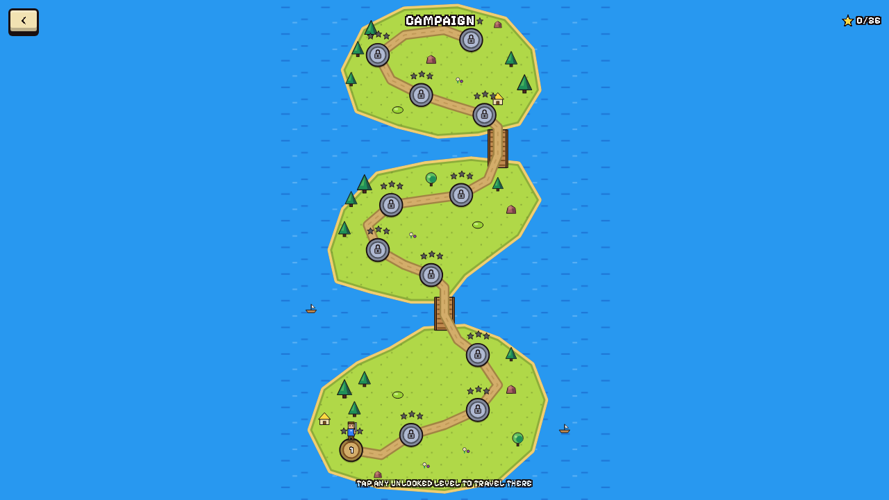
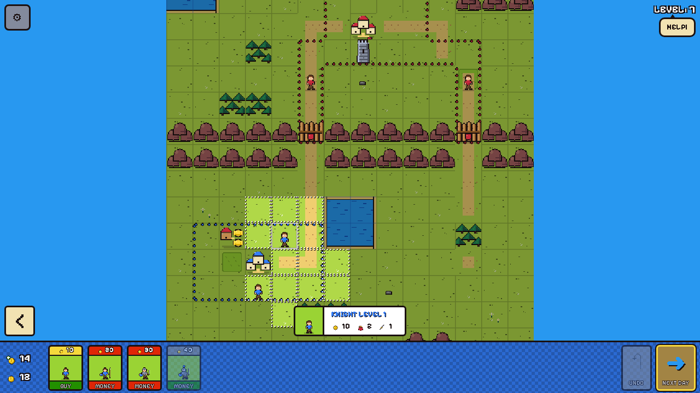
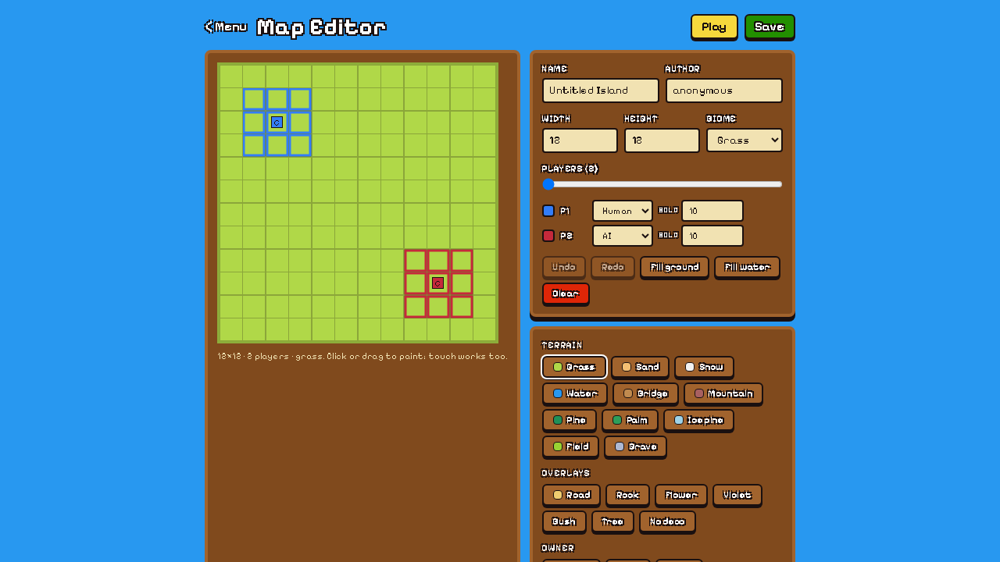
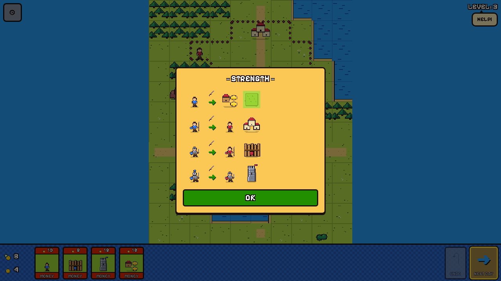
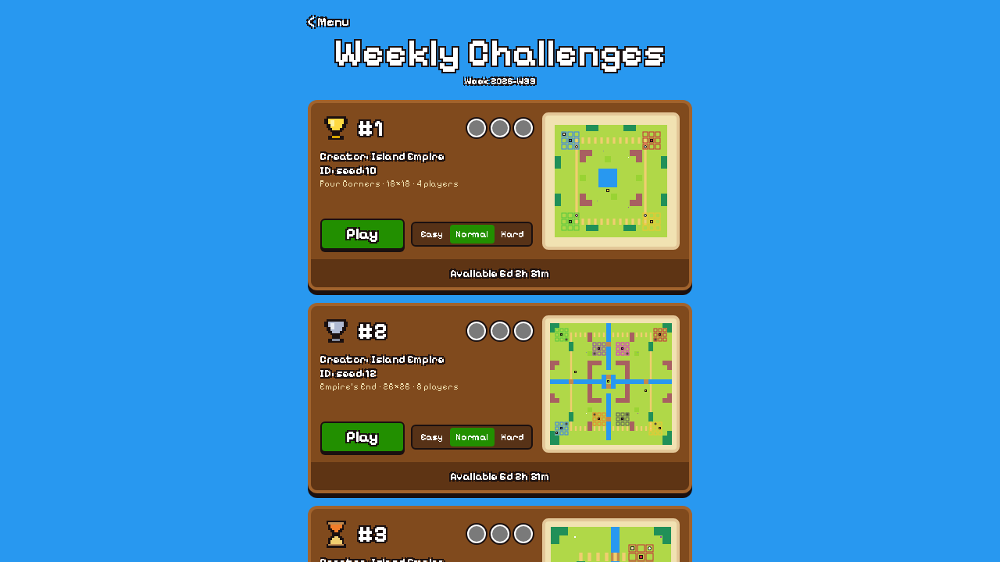
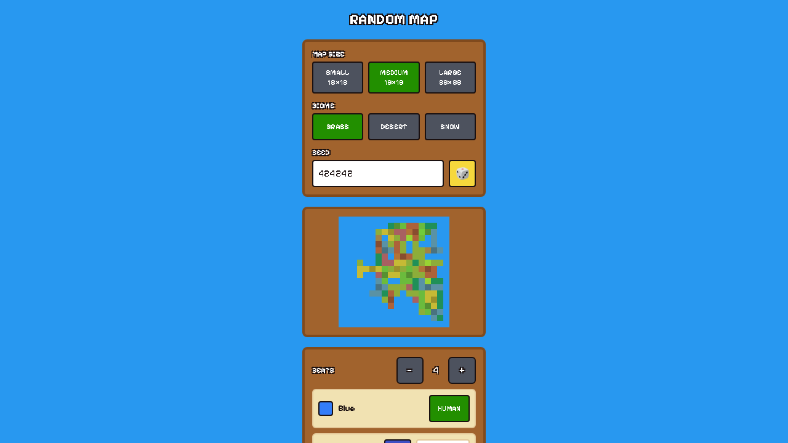

# Island Empire

> **every tile pays one gold a day; every knight eats it**

A browser rebuild of [Island Empire](https://play.google.com/store/apps/details?id=com.hbrz.wodan)
(HBRZ-Developer, 2020), the mobile Slay-like where you conquer a square-gridded
island one tile at a time. The rules, the numbers on the unit cards, the way a
wall protects only its own tile and a city protects the four around it — all of
it was read off the real game's screenshots and walkthrough videos, because the
developer publishes no rulebook. Anyone who opens the site can play: a twelve-level
campaign, random maps against the AI, hot-seat for up to eight, weekly
challenges, and a map editor whose maps are shareable by link.

| Overworld | A level | Map editor |
|---|---|---|
|  |  |  |

| Strength chart | Weekly challenges | Random map |
|---|---|---|
|  |  |  |

**The game is a square grid, not a hex grid.** Every text source — reviews,
store copy, the genealogy back to Slay and Antiyoy — says hex, and the research
lanes that worked from text alone wrote hex into their notes. The screenshots
say otherwise: thin square grid lines, bead borders along straight edges, and
shield badges that never appear on a diagonal. The engine, the renderer and the
map editor were built on 4-neighbour adjacency because of a crop of a single
frame (`research/screenshots/video/crop-shields-wt-0330.png`), and the wrong
notes were kept with a correction header rather than deleted.

**Every number was measured, then the gaps were chosen on purpose.** Knight
level 1 costs 10 and eats 2 a day, level 2 costs 20 and eats 5, a woodwall costs
5 and defends at 2, a farm costs 12 and pays 5 — all read off unit cards in the
walkthroughs. Level 3 and 4 upkeep (12 and 30) and the stone tower (15, 1 a day,
strength 3) never appear on a card anywhere, so they are extrapolations and are
labelled as such in `DECISIONS.md` (D3, D4). The Easy AI recruits one knight per
province per turn because a scripted first-time player lost eleven of twelve
levels to an Easy AI that fielded a knight for every spare ten gold (D39).

**The engine is a pure function and a test proves it.** `apply(state, action)`
returns a new state and a list of events; nothing in `src/engine` may import
React, the DOM or another layer, call `Math.random` or read the clock, and
`layering.test.ts` scans the source to enforce it. The AI, the random-map
generator and undo (a replay of the turn's history from a snapshot) all live
inside that boundary, so a whole AI turn is computed synchronously and the
runner merely animates the result. Every sprite is drawn from code onto a
32-pixel canvas and blitted nearest-neighbour — nothing in the repository is an
asset, because there is no legitimate way to obtain the original art.

Next.js 16 · canvas renderer with code-drawn pixel art · a pure engine with an
enforced layering rule · **434 unit and property tests** · 25 e2e tests across
desktop and mobile Chrome · PostgreSQL only for sharing custom maps (WASM
locally, Neon deployed). Built from six parallel research lanes, then five
parallel build slices, then eight rounds of codex review (41 findings, every one fixed or reconciled in `DECISIONS.md`; a ninth round was blocked by the Codex workspace running out of credits, so the loop did not end on an explicit clean verdict).

## Index

| Path | What it is |
|---|---|
| [`SPEC.md`](SPEC.md) | The contract the code was built against: rules with every number, architecture, screens, visual design, tests, slices |
| [`DECISIONS.md`](DECISIONS.md) | D1–D41, each with its reasoning and the evidence file it rests on |
| [`research/06-research-brief.md`](research/06-research-brief.md) | The consolidated, screenshot-verified brief — read this before touching a rule |
| [`research/`](research) | Six lanes (repo conventions, rules, modes, UX, genealogy, visual design), store screenshots, walkthrough contact sheets and crops |
| `src/engine/` | Rules, provinces, move zones, AI, generator, serialisation, validation — pure TypeScript |
| `src/render/` | Palette, camera, sprite atlas, the canvas painter |
| `src/game/` | The session runner, input gestures, session config store, tutorial triggers |
| `src/components/` | In-game HUD, menus, editor, setup screens, shared pixel UI |
| `src/content/levels/` | The twelve levels as ASCII grids plus their tutorial scripts |
| `src/adapters/`, `src/app/api/` | PGlite/Neon repository and the three API routes |
| `e2e/` | Playwright: campaign to victory, touch gestures, random and hot-seat, editor round-trip, screenshots |

## Quick start

```bash
pnpm install
pnpm run dev        # http://localhost:3000 — no database needed
pnpm run verify     # typecheck + lint + 434 unit tests
pnpm run test:e2e   # production build + Playwright on port 3200
```

The game runs with an empty environment. PGlite (Postgres compiled to
WebAssembly) holds custom maps locally; setting `DATABASE_URL` switches to Neon.
Progress, settings and challenge medals live in the browser's `localStorage`.

## The game

**Rules in one breath.** Your land is split into provinces: connected groups of
at least two tiles, each with a city that banks the province's gold. Every owned
tile pays 1 a day, a farm pays 5, a mine 8, a chest 10 once. Knights cost
10/20/30/40 and eat 2/5/12/30 a day; if a province cannot pay, every knight in it
dies and leaves a grave. A knight defends its tile and the four beside it at its
level; a city defends at 1; a woodwall (2) or stone tower (3) defends only
itself. To take a tile your knight must be strictly stronger than its defence.
Two knights merge into one of the summed level, up to 4. Take every enemy city
and the island is yours.

**Campaign.** One island, twelve hand-made levels: five tutorials that mirror the
original's first five (down to "I CAN'T PASS THE WALL!" and "WE NEED A LEVEL 2
KNIGHT"), then rivers with bridges, mountain passes, a desert, a fjord in snow, a
four-player crossroads, a gold rush and an eight-player finale. Each level plays
on Easy, Normal or Hard (the AI tier plus its starting-gold handicap) for one
star each. The overworld walks an avatar along the path like the original does,
and also lets you tap any unlocked node — the one change reviewers of the
original asked for.

**Random maps and hot-seat.** Pick a size, a biome, two to eight seats (human or
AI, with a difficulty each) and a seed. Hot-seat hides the board behind a
"pass the device" screen between human turns.

**Weekly challenges.** Three maps chosen deterministically from the ISO week —
seeded puzzle levels plus every community map anyone has saved — with a medal
per difficulty beaten and a countdown to next Monday.

**Map editor.** Paint terrain and biomes, set owners, place cities, farms,
mines, chests, walls and knights, validate live, then save: the map gets a link
at `/maps/<id>` that anyone can open and play.

## Controls

| Action | Mouse / touch | Keyboard |
|---|---|---|
| Select a knight or tile | click / tap | — |
| Move, attack, merge | click / tap a lit tile | — |
| Buy | tap a card, then a lit tile | — |
| Deselect | the "<" button, or tap empty space | `Esc` |
| Pan / zoom | drag / wheel, pinch | arrows or `WASD`, `+` `-` |
| Undo / Next day | the buttons | `Z` / `Enter` |

## Architecture

```
src/engine        pure: types, rules, provinces, moveZone, reducer, ai, generator, serialize, validate
   ↑ apply(state, action) → { state, events }
src/game          session runner, animation queue, input, autosave, debug handle
src/render        camera, palette, sprite atlas, painter (dirty-flag redraw)
src/components    HUD and screens (React, zustand for UI state only)
src/ports         SettingsPort, ProgressPort, MapsRepository
src/adapters      localStorage; PGlite (dev/e2e) and Neon (production) via getDb()
src/app/api       /api/maps, /api/maps/[id], /api/challenges/current
```

The engine publishes two contracts the rest of the app compiles against —
`src/engine/types.ts` and `src/engine/index.ts` — and they were written before a
single rule was implemented so five developers could build in parallel.

## Deploying

The project is its own Vercel project (`island-empire-david`), deployed by hand
from this directory:

```bash
npx vercel deploy --prod --yes
```

`DATABASE_URL` comes from the Neon integration attached to the project; the
schema is applied by `pnpm run db:push` (idempotent). Everything else runs in
the browser.

## What is verified, and what is not

- **Verified.** Every rule in SPEC §3 has a fixture test; province invariants and
  determinism hold under fast-check; a Normal AI driving the human seat beats the
  Easy AI on all levels 01–11 across three seeds; the e2e suite plays level 01 to
  victory through the real UI on desktop and mobile, runs a random map twenty
  rounds against the AI, saves an editor map and plays it from its share link.
- **Not verified.** Level 12's eight-player finale is validated and playable but
  no scripted player finishes it within 25 rounds; the balance of levels 06–12
  for a human on Hard is a judgment, not a measurement; the original's online
  mode, IAP and skins are out of scope by design.

## What this is

A study in building an established game from research alone: no decompiled
code, no assets, no rulebook — screenshots, three walkthrough videos and the two
games this one descends from. The research folder is the argument for every
choice; where the evidence ran out, `DECISIONS.md` says so.
