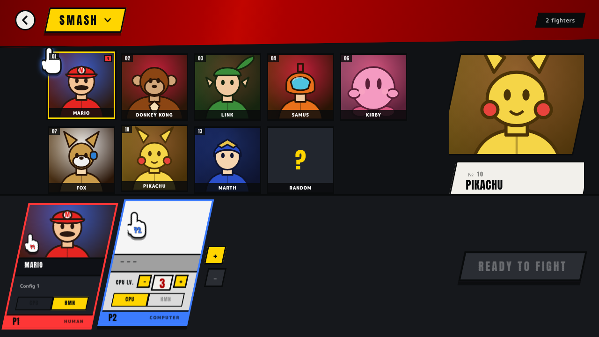
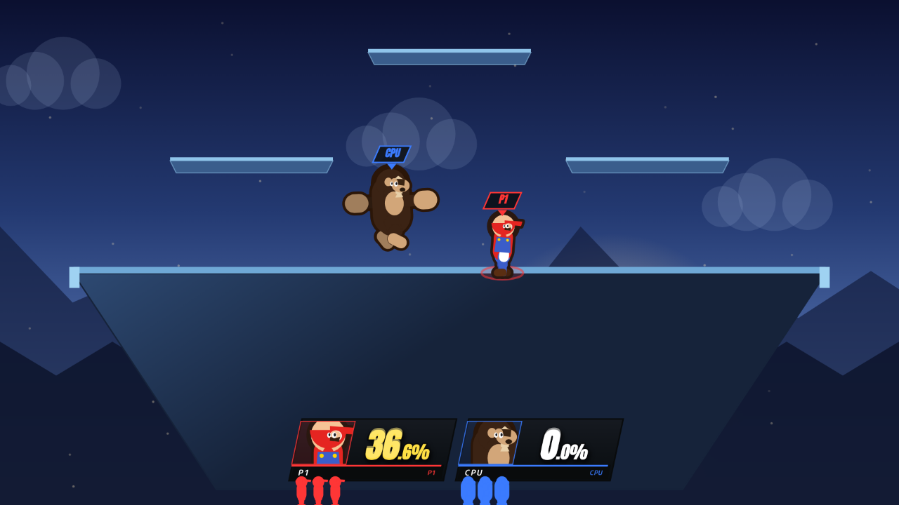
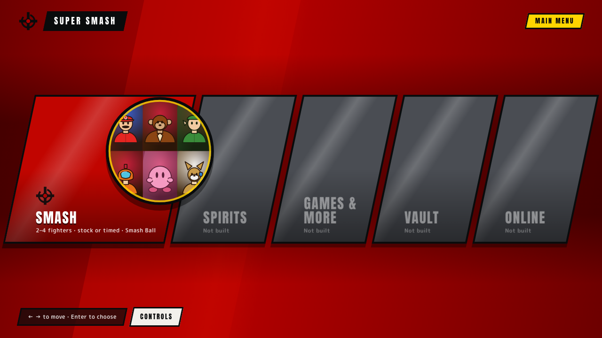
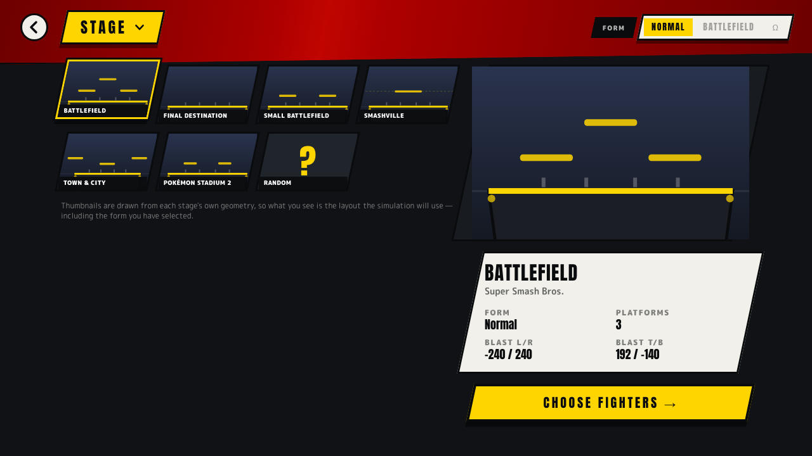
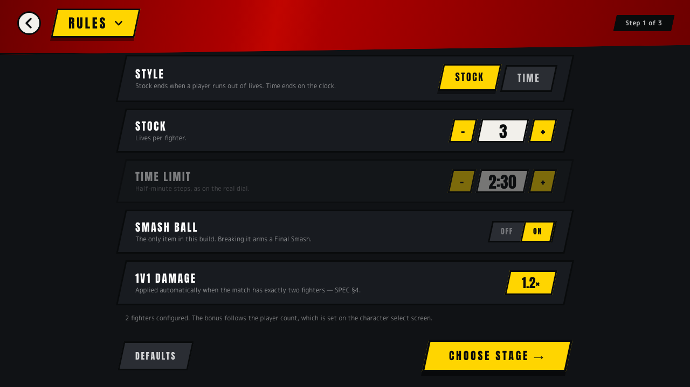
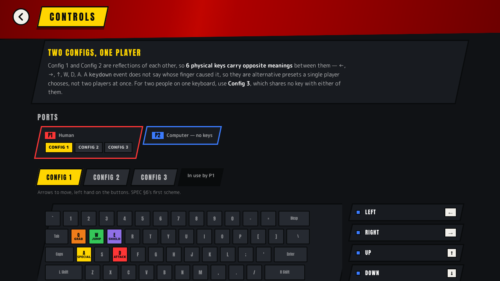

# Super Smash

> **eight fighters, one keyboard, sixty frames a second**

A browser rebuild of [Super Smash Bros. Ultimate](https://www.smashbros.com)'s versus mode —
the brawl, which is the mode that has carried across every game in the series since 1999 and
is the one nearly everybody actually plays.

The menus, the HUD and the physics are reproduced from measured values rather than
approximated by feel: the knockback equation is Ultimate's, the stage geometry is Kurogane
Hammer's, and the frame data comes out of the game's own decompiled scripts. The fighters
are drawn from code — a bone hierarchy of capsules and circles — because there is no
legitimate way to obtain Nintendo's art, and because every open-source Smash clone that
tried to ship real sprites stalled on making them.

It also does one thing the original does not: **rollback netcode**. Ultimate is delay-based.

---

## Index

| Path | What's in it |
|---|---|
| [`SPEC.md`](SPEC.md) | The contract this was built against — architecture, formulas, controls, roster, stages |
| [`DECISIONS.md`](DECISIONS.md) | Every non-obvious choice and why, including the ones that were wrong first |
| [`research/physics-and-knockback.md`](research/physics-and-knockback.md) | Ultimate's combat maths, formula by formula, with the two places the sources disagree |
| [`research/netcode-and-latency.md`](research/netcode-and-latency.md) | Rollback, determinism in JavaScript, and why shared WiFi needs no code at all |
| [`research/keyboard-controls.md`](research/keyboard-controls.md) | Translating an analog stick onto keys, and what is genuinely lost |
| [`research/ui-and-visual-language.md`](research/ui-and-visual-language.md) | Every screen, pixel-sampled from the real game |
| [`research/stages-and-rendering.md`](research/stages-and-rendering.md) | Stage geometry, prior art, and how to make a hit feel like a hit |
| [`research/fighters-and-cpu-ai.md`](research/fighters-and-cpu-ai.md) | The roster's numbers, the sourcing trap that nearly poisoned them, and how Smash's CPUs behave |
| [`research/art-audio-and-licensing.md`](research/art-audio-and-licensing.md) | Shipping a Smash homage as source code, with nothing to license |
| [`src/engine`](src/engine) | The simulation: fixed-point maths, knockback, hitboxes, the action state machine |
| [`src/fighters`](src/fighters) | Eight fighters, every attribute and every move |
| [`src/stages`](src/stages) | Six stages, and the Ω / Battlefield forms as a data transform |
| [`src/render`](src/render) | The canvas painter — skeletons, poses, camera, VFX, HUD |
| [`src/render/poses`](src/render/poses) | One file per animation, each with the frame budget it was drawn to |
| [`src/render/chars`](src/render/chars) | One directory per fighter: their rig, their own clips, what their moves paint |
| [`docs/character-art.md`](docs/character-art.md) | How to make a character look like themselves — the four layers and the gotchas |
| [`src/net`](src/net) | Rollback session, wire format, and three transports |
| [`src/ai`](src/ai) | CPU levels 1–9, as a pure function |
| [`src/input`](src/input) | Three control schemes and the latched keyboard reader |
| [`src/audio`](src/audio) | Every sound, synthesised — no audio files ship |
| [`src/game`](src/game) | The fixed-timestep loop that joins the simulation to the browser |
| [`e2e`](e2e) | Playwright specs, including the screenshot capture |
| [`scripts/animsheet.mjs`](scripts/animsheet.mjs) | Captures any animation as a contact sheet, one cell per frame |
| [`scripts/fightsheet.mjs`](scripts/fightsheet.mjs) | Captures a move *as played* — swing arc, projectile, hit spark — by cranking a paused match by hand |
| [`docs/screenshots`](docs/screenshots) | The images in this README |

## Quick start

```bash
pnpm install
pnpm run dev
```

Open <http://localhost:3000>. Nothing to configure — no keys, no database, no account. The
whole game runs in the browser.

| Command | What it does |
|---|---|
| `pnpm run dev` | Development server on :3000 |
| `pnpm run build` | Production build |
| `pnpm start` | Serve the production build |
| `pnpm test` | Unit and property tests (vitest) |
| `pnpm run test:watch` | The same, watching |
| `pnpm run test:e2e` | Playwright end-to-end |
| `pnpm run test:e2e:ui` | The same, with the inspector |
| `pnpm run typecheck` | `tsc --noEmit` |
| `pnpm run lint` | ESLint |

Screenshots are captured, not taken by hand:

```bash
CAPTURE=1 npx playwright test screenshots --project=desktop-chrome
```

Animation has its own workshop at **<http://localhost:3000/anim>** — pick any fighter and any
action and it draws one cell per simulation frame at the action's true length, with 60Hz
playback and an onion skin. The same strip can be captured from the command line:

```bash
node scripts/animsheet.mjs roll --fighter kirby --out roll.png
```

It exists because animation is the one thing here that cannot be judged from its source, and
because without it a whole class of bug is invisible: seventeen of the twenty-one movement
clips turned out to be a single frozen pose held for the length of the state
([D39](DECISIONS.md#d39--seventeen-of-the-twenty-one-movements-were-a-single-frozen-pose)).

The lab draws the pose. Half of what makes an attack read is drawn by the *match* — the blade
arc, the projectile, the spark, the opponent flinching — so there is a second capture for that,
which starts a real match, stops the clock and steps it by hand:

```bash
node scripts/fightsheet.mjs --fighter link --move fsmash --out link-fsmash.png
node scripts/fightsheet.mjs --fighter samus --move neutralB --frames 0,8,16,24,32
```

A screenshot costs about fifteen simulation frames, so a *running* match cannot be photographed
mid-attack at all — which is why every animation in the game was being judged from whatever
frame the shutter happened to land on
([D46](DECISIONS.md#d46--photographing-a-move-as-it-is-actually-played)).

Making one character look like themselves has its own guide:
**[docs/character-art.md](docs/character-art.md)** — the four layers a fighter is made of, which
files belong to which character, and the conventions that have each cost somebody a day.

Eight people working on eight characters at once turns out to be a bug-finding instrument as much
as an art pipeline: what it converges on is the *shared* code, and the second pass found a
velocity delivered in the wrong units, an authoring view that disagreed with the renderer four
different ways, and an engine branch that had silently disabled scripted vertical movement for the
whole roster ([D52](DECISIONS.md#d52--round-two-and-what-a-review-of-it-kept-finding)).

A reported crash inside React's own RSC client turned out not to be the app's, and chasing it
found the three errors that were: a hydration warning on every page load, a missing favicon that
was quietly pulling a second copy of React into the build, and no error boundary anywhere — so any
throw left a blank page
([D53](DECISIONS.md#d53--the-runtime-errors-and-which-of-them-the-app-was-actually-causing)).

---

## The game

| Character select | The match |
|---|---|
|  |  |

| Main menu | Stage select |
|---|---|
|  |  |

| Rules | Controls |
|---|---|
|  |  |

---

## Controls

Two schemes, mirror images of each other, both keyed on physical key position so they
survive a non-QWERTY layout.

| Action | Config 1 — Arrows | Config 2 — WASD |
|---|---|---|
| Move | `←` `→` `↑` `↓` | `W` `A` `S` `D` |
| Special | `A` | `←` |
| Attack | `D` | `→` |
| Jump | `W` | `↑` |
| Shield | `E` | `Shift` |
| Grab | `Q` | `/` |

**These two cannot be used at the same time**, and that is a property of the layouts rather
than a bug: they are mirror images, so six physical keys carry opposite meanings between
them — `W` is Config 1's jump and Config 2's up, `←` is Config 1's left and Config 2's
special. A `keydown` event reports a key, not a finger. They are therefore alternative
presets a player chooses, and a **third preset on a disjoint cluster** exists for two people
on one laptop. The binding UI refuses a key another active player already holds
([D8](DECISIONS.md#d8--the-two-control-schemes-are-alternatives-not-two-players)).

**Up jumps, exactly as pushing the stick up does**, and the same key still aims your attacks
— `↑`+`D` is an up-smash, `↑`+`A` is your recovery. A stick tells those apart by magnitude
and a key has none, so an up press waits 5 frames to see whether an attack follows before it
becomes a jump. That is precisely as long as it stays eligible to *be* an up-smash. The
dedicated jump key has no such ambiguity and fires on the frame it is pressed, which is what
it is for ([D31](DECISIONS.md#d31--up-jumps-and-still-aims-and-the-arbitration-is-five-frames-long)).

**A keyboard has no stick magnitude**, so the other distinctions Smash draws from *how far*
and *how fast* the stick moved are recovered from timing too: an attack within 5 frames of a
fresh direction press is a smash, otherwise a tilt; a jump released inside the 3-frame
jumpsquat is a short hop; each fresh direction press during hitlag is one SDI pulse, so
mashing works exactly as it does in the real game.

**Every key is rebindable, per player.** `/controls` assigns a preset to each port and
rebinds any action in it; the match reads the bindings the player actually chose
([D33](DECISIONS.md#d33--a-rebinding-ui-the-match-never-read)).

Walking is not reachable, and that is correct rather than missing — a key is always a *full*
deflection, and a fully-deflected stick dashes. Micro-spacing comes from tapping.

---

## Architecture

```
   app/ · components/        menus, character select, the game shell (React)
           ↓ sends inputs, reads state
   render/ · audio/ · ai/ · net/    canvas, Web Audio, CPU, rollback
           ↓ step(state, inputs) → state, events
   engine/ · fighters/ · stages/    THE SIMULATION — pure, deterministic
```

The rule that makes the rest work: **`engine/` imports nothing from React, Next, the
renderer, the netcode or the UI, and calls no browser API at all.** It is a pure function,
`step(state, inputs) → state`, and `src/engine/layering.test.ts` walks the source to enforce
it — failing the build on a forbidden import *or* on a call to `Math.random`, `Date.now`, or
any of `Math.sin/cos/tan/pow/exp/log/atan2`.

That last list is not fussiness. Basic IEEE-754 arithmetic is specified tightly enough to be
bit-identical across engines, but the transcendental functions are only *recommended* to be
precise — two browsers may legally differ in the last bits. A launch angle resolved through
`Math.cos` is exactly the kind of value that diverges silently over a few hundred frames and
surfaces as "that killed on their screen and not on mine". So every quantity the simulation
can branch on is a **Q12 fixed-point integer**, trigonometry comes from an integer lookup
table, and randomness is a seeded generator whose state lives inside `GameState` and rolls
back with everything else ([D3](DECISIONS.md#d3--the-simulation-is-fixed-point-integers-and-trigonometry-comes-from-a-table)).

Cosmetic state — particles, screen shake, sound — lives *outside* `GameState` and is driven
by the events `step()` returns, so re-simulating eight frames after a rollback does not
replay eight frames of explosions ([D4](DECISIONS.md#d4--cosmetic-state-lives-outside-gamestate)).

---

## Multiplayer

Rollback netcode, over WebRTC, with **2 frames of input delay** and an 8-frame prediction
cap. Your own input is never delayed by the network; the opponent's is predicted and
corrected. Smash Ultimate itself is delay-based, so this is the one axis on which the
replica is deliberately better than the original.

**Shared WiFi needs no code.** ICE gathers host candidates for every local interface, and
when two peers share a subnet the connectivity check succeeds on those alone — no STUN, no
TURN, no relay, no server in the path. So nothing special-cases a local network: one
signalling path is used for every match, and ICE's own candidate prioritisation finds the
LAN route. Two laptops in the same room get a direct sub-10ms path for free
([D9](DECISIONS.md#d9--rollback-over-webrtc-with-no-lan-special-case)).

Packet loss is handled by **redundancy rather than retransmission** — every packet carries a
window of the last 10 frames of input, so a dropped one heals itself 16ms later. A resent
input for frame N is worthless once the game is predicting frame N+5.

Measured against a ground-truth single-machine run, not merely against the peer:

| Link | Rollbacks | Max prediction | Converged |
|---|---|---|---|
| 0ms | 0 | 0 | ✅ |
| 100ms | 195 | 5 | ✅ |
| 60ms + 40ms jitter | 108 | 4 | ✅ |
| 50ms + 10% loss | 112 | 3 | ✅ |
| 50ms + 33% loss | 105 | 7 | ✅ |
| 150ms + 40ms jitter | 82 | 8 | ✅ |

---

## Deploying

Vercel detects this with zero configuration — point the project root at `super-smash/`.
Every route prerenders as static content; there is no backend, no database and no
environment variable you have to set.

| Variable | Why |
|---|---|
| `NEXT_PUBLIC_SIGNAL_STRATEGY` | Which public network Trystero uses to introduce two peers. Defaults to BitTorrent trackers. Only carries the handshake. |
| `NEXT_PUBLIC_ROOM_PREFIX` | Namespaces room codes, so two builds do not share matches. |
| `NEXT_PUBLIC_INPUT_DELAY` | Frames held back before prediction. Default 2. |

---

## Known gaps

1. **No TURN server.** On the open internet, some NAT combinations will fail to connect
   peer-to-peer. Local network play — the case the design targets — is unaffected.
2. **Fighters have no walk initial velocity.** Ultimate gives each fighter a small starting
   speed (Mario's is about 0.5) so the first walk frame is a step rather than a ramp from
   zero. `FighterAttributes` carries only a top walk speed, so a one-frame tap travels
   about a third of what it should.
3. **Hitbox positions on limbs are estimated.** Damage, frames, angles and knockback come
   from the decompiled scripts and are exact; hitboxes mounted on limbs depend on animation
   data this project does not have, and are marked `// POSITION: estimated` in the source
   ([D17](DECISIONS.md#d17--move-data-comes-from-the-decompiled-scripts-not-from-a-frame-data-site)).
4. **Shield-break stun is a stand-in.** No source publishes the coefficients, and the wiki
   that likely has them refused every fetch.
5. **Eight fighters, not eighty-nine.** They were chosen to span the archetype space so the
   physics is actually exercised — a super-heavyweight, a featherweight, a zoner, a
   fast-faller, a multi-jumper, a sword spacer.
6. **No items but the Smash Ball**, no Spirits, no World of Light, no Classic Mode. Cutting
   them is what made the remaining part reproducible properly
   ([D1](DECISIONS.md#d1--only-the-brawl-and-only-one-item)).
7. **Desktop only.** Every control is a physical key and a phone has none, so a touch device
   is told so rather than shown a layout nobody can play.

---

## What this is

A study, not a product, and not affiliated with Nintendo in any way.

**Super Smash** is a rebuild of Super Smash Bros. Ultimate's versus mode as an exercise in
agentic software development. Every character, sound and image in this project is generated
from code: no Nintendo sprites, models, music or logos are used, reproduced or distributed
anywhere in this repository. Super Smash Bros. and all related characters and trademarks are
the property of Nintendo. Non-commercial, educational, and free.

It was built from eight parallel research lanes, then a frozen engine contract, then six
parallel build slices — engine, roster, renderer, menus, input and AI, netcode and audio —
reviewed and converged before shipping.
